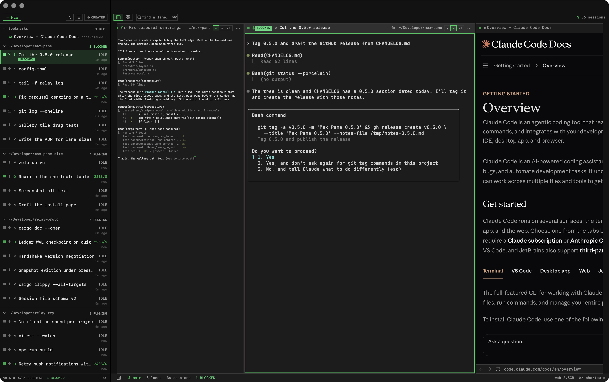

# Max Pane

Terminals and web pages as columns on one infinite strip. A fullscreen macOS
app for watching several coding agents run while you read what they cite.



- **Lanes, not windows.** A terminal and a web page are peers. Each is a
  portrait column; wide content scrolls inside the lane, and the lane never
  widens past its max. Lanes never overlap.
- **One lane per agent session.** A sidebar lists every running session and
  says which one is BLOCKED on a prompt. That one is the brightest green, and it
  pulses. Click it and you are there.
- **⌘O starts anything.** A command, a URL, a page you have kept, a session
  that is already running somewhere else. One key, because "something goes to
  the right of this" is a single decision.
- **⌘G is the gallery.** Every lane on one screen, live. ⌘G again goes back.
- **It keeps your things.** History with no limit, pages you star, passwords in
  the Keychain and nowhere else, every setting in a TOML file that keeps your
  comments where you put them.

## Install

Max Pane needs an Apple silicon Mac on macOS 14 or newer, and [relay-tty](https://github.com/ddrscott/relay-tty)
1.22.0 or newer, the daemon that owns the terminal sessions.

With Homebrew, both at once (relay-tty comes in as a dependency):

```sh
brew install --cask ddrscott/tap/max-pane
```

Or by hand:

1. Install relay-tty:

   ```sh
   curl -fsSL https://raw.githubusercontent.com/ddrscott/relay-tty/main/install.sh | bash
   ```

   Or, if you already have Node 18 or newer, `npm i -g relay-tty`.

2. Download the DMG from the [v0.6.0 release](https://github.com/ddrscott/max-pane/releases/tag/v0.6.0),
   drag Max Pane to Applications, and open it.

3. Press **⌘O**, type `claude`, press **↩**. Press **⌘/** for every other
   shortcut.

## Status

**0.6.0.** What it does today is in [CHANGELOG.md](CHANGELOG.md), and nothing
here claims more than that. Built and used daily by one person; bugs go in
[Issues](https://github.com/ddrscott/max-pane/issues).

**Contents:** [Install](#install) · [Using it](#using-it) ·
[Building from source](#building-from-source) · [Layout](#layout) ·
[Toolchain](#toolchain) · [Requirements](#requirements) · [Build](#build) ·
[Test](#test) · [RelayTTY](#relaytty) · [Conventions](#conventions) ·
[License](LICENSE)

---

## Building from source

The spec is [`docs/PRDSwift.md`](docs/PRDSwift.md). This README is the source of
truth for how to build and work on it.

**Design invariant:** a lane is a portrait-bounded column. Wide content scrolls
inside the lane; the lane never widens past its max.

---

## Layout

```
crates/laned-core/     Rust. The ledger, ordinals, tagging, search, eviction policy.
                       Platform-agnostic — no AppKit concepts leak in here.
swift/MaxPaneCore/     The Rust core as a Swift module (uniffi-generated).
swift/MaxPane/         The app. Rendering, input, WKWebView/SwiftTerm lifetimes.
spikes/                Phase 0 spike programs. Kept: they are how the numbers
                       in docs/spikes/ were obtained.
docs/decisions/        ADRs. One per open decision in PRD §14.
docs/spikes/           Spike reports, with measured numbers.
docs/reference/        External protocol references (RelayTTY).
docs/proposals/        Proposed changes to external dependencies. See "RelayTTY".
```

**Everything durable lives in `laned-core`.** The Swift app is a view. If a piece
of state would be lost when the app quits, it is in the wrong place.

---

## Toolchain

This machine has **Command Line Tools, not Xcode**. `xcodebuild` does not work and
is not needed: the app is a SwiftPM package, and the `.app` bundle is assembled by
hand and ad-hoc signed. Do not introduce an `.xcodeproj`.

Homebrew's `rust` formula (1.86) shadows rustup in `PATH` and is too old for
uniffi 0.32. `rust-toolchain.toml` pins stable, but only rustup's shims honour it:

```sh
export PATH="/opt/homebrew/opt/rustup/bin:$PATH"   # or: source scripts/env.sh
```

Everything in `scripts/` does this for you.

## Requirements

Nothing from RelayTTY is compiled into MaxPane. The app is a third-party client
of a daemon that has to be installed separately, and that is the one thing a
fresh machine needs before the app will start a session:

```sh
curl -fsSL https://raw.githubusercontent.com/ddrscott/relay-tty/main/install.sh | bash
```

Or, with Node 18 or newer already installed, `npm i -g relay-tty`.

**relay-tty 1.22.0 or newer**, which is the release that added agent state.
An older `relay-pty-host` starts sessions fine and never reports BLOCKED, with
nothing anywhere saying why.

At launch the app finds `relay-pty-host` by walking up from wherever `relay`
resolves on your login shell's `PATH` (an npm global, or a source checkout),
then `/usr/local/bin`, then `PATH` itself. When more than one turns up it takes
the newest that has the agent-state classifier. `relayPtyHostPath` in the
config file names one outright and skips the search. Sessions, sockets and
titles all live in `~/.relay-tty`, which the daemon owns and the app only
reads, so a session started from `relay` in a terminal and one started from
⌘O are the same kind of thing.

Building needs the toolchain below. Running the built app needs only an Apple
silicon Mac on macOS 14 or newer, and relay-tty.

## Build

```sh
./scripts/build-app.sh         # everything: core, bindings, app, bundle, signing
./scripts/build-app.sh release run   # ...and launch it
```

Signing is the last step and it is not optional. WKWebView will not spawn its
content processes for an unsigned, unbundled binary, and adding a file to the
bundle *after* signing breaks the seal — with no symptom until something checks,
so `build-app.sh` checks.

For the core alone:

```sh
./scripts/gen-bindings.sh      # build laned-core, regenerate the Swift bindings
cd swift/MaxPane && swift build
```

Re-run `gen-bindings.sh` after changing any `#[uniffi::export]` signature. The
generated module **must** be called `laned_coreFFI` — the generated Swift does
`#if canImport(laned_coreFFI)`, and a different name compiles cleanly with no FFI
symbols at all, which fails at link time in a thoroughly unhelpful way.

`gen-bindings.sh` also stages `liblaned_core.a` into `swift/MaxPaneCore/lib/`,
and that directory — never `target/` — is the Swift linker's only search path
for the core. cargo leaves a `.dylib` beside the `.a` in `target/`, ld prefers
the `.dylib`, and an app linked that way loads the core from this checkout by
absolute path at runtime. The next `cargo build` that changes the FFI then
kills every launch of the installed app with a uniffi checksum trap in
`Core.open`. `build-app.sh` refuses to assemble a bundle that links the dylib.

### The app icon

`swift/MaxPane/Resources/AppIcon.icns` is generated, not hand-made. The master
is `AppIcon-source.png` next to it: a full-bleed 1024px square. Run
`./scripts/gen-app-icon.py` after changing the PNG and commit both files. The
script masks the artwork to Apple's squircle on a transparent canvas, because
macOS 26 clips a square icon to its own squircle and paints the glass rim over
the cut, which shows as a pale ring and light corners.

### Passkeys and the provisioning profile

Passkeys (WebAuthn) do not work in a web pane yet, and the reason is not in
this repository. WebKit only answers `navigator.credentials` for a process that
holds `com.apple.developer.web-browser.public-key-credential`, and that key is
a *managed capability*: Apple grants it to a team after reviewing the app as a
web browser, and the grant reaches the bundle as a provisioning profile. A
bundle signed with the key and no profile is killed at launch — exit 137,
before a byte of output, nothing in the unified log — which was measured on
2026-09-16 (`docs/acceptance.md`, "Passkeys and picture-in-picture"). So the
key is **not** in `MaxPane.entitlements`, and never will be; it enters through
the build only when a profile is present.

The plumbing is done and tested. What is **not done**, because it needs the
Account Holder's Apple Developer account and cannot be done from a build box:

1. **File the request.** Signed in as the Account Holder at
   developer.apple.com, open the request form for the *Web Browser Public Key
   Credential* capability (Account → Contact Us → "Request a capability"; the
   form is the one for `com.apple.developer.web-browser.public-key-credential`).
   Apple's published criteria, which Max Pane meets, are worth stating in the
   form: it registers for `http` and `https` (`CFBundleURLTypes` in
   `Info.plist`), it has a URL field on launch (the address in every web lane's
   chrome bar), and it navigates to the typed destination directly. State the
   bundle id (`app.ljs.maxpane`), the team (`DH6NDWAQQ2`) and that
   distribution is Developer ID, not the App Store. Then write
   `docs/decisions/0017-passkeys-capability.md` with the request date, and the
   outcome when it comes — including "denied", if that is what comes back.
2. **Once granted, make the profile.** In Certificates, Identifiers & Profiles:
   the `app.ljs.maxpane` identifier gains the capability under Additional
   Capabilities; then create a *Developer ID Application* provisioning profile
   for that identifier with the Developer ID Application certificate on this
   Mac, download it, and put it at **`packaging/MaxPane.provisionprofile`**
   (git-ignored; it lives on the release Mac only). `MAXPANE_PROVISIONING_PROFILE`
   points somewhere else; set it empty to build without a profile that is there.
3. **Build, and check the two words.** `./scripts/build-app.sh release` prints
   `passkeys: on — profile … (team …, app …, expires …)` and embeds the profile
   as `Contents/embedded.provisionprofile`; `codesign -d --entitlements :-
   build/MaxPane.app` shows the key. `make-dmg.sh` refuses a bundle where the
   key and the embedded profile disagree.
4. **Prove it**, in a throwaway instance (`MAXPANE_APP=build/verify.app`), and
   write the result into `docs/acceptance.md`:
   `PublicKeyCredential.isUserVerifyingPlatformAuthenticatorAvailable()` is
   `true`, and Register on webauthn.io shows the system passkey sheet. A
   throwaway username, never a real account. If the app is killed at launch
   with the profile in place, the profile does not match the bundle: check the
   team, the identifier and the expiry, which `scripts/entitlements.sh` checks
   too and would have refused had they been readable from the file.

What the scripts do, so the behaviour without a profile is recognisable as
today's: `scripts/entitlements.sh` is asked for the entitlements to sign with,
and answers `off` — the shipped file, byte for byte — when there is no profile,
when the signature is ad-hoc (a managed capability needs a team, so an ad-hoc
build ignores any profile), or when the profile covers a different bundle id
(a throwaway `build/verify.app` is not the app Apple approved). It answers
`on` — the shipped file plus the key and the profile's own
`com.apple.application-identifier` and `com.apple.developer.team-identifier`,
which the kernel matches against the profile — only for a profile that grants
the key, has not expired and names the signing identity's team. A profile that
is present but fails any of those stops the build with the reason, rather than
shipping a build that quietly lacks what was asked for. If Apple declines the
request, nothing changes in the build: the ADR records it, and the paragraph
in [A web lane](#a-web-lane) stays as it is.

### Releasing

`scripts/release.sh` cuts the GitHub release for the version in
`swift/MaxPane/Resources/Info.plist`; its header comment has the three steps.
The version is hand-set there and in `Cargo.toml`, and one contract keeps the
app honest about it: **`CHANGELOG.md`'s top released section must be the
plist's version.** `release.sh` refuses when it is not, beside its refusal of a
dirty tree, through `scripts/changelog-version.sh` (which
`scripts/tests/changelog-version.sh` pins). The check exists because the app
reads the changelog: `build-app.sh` copies it into `Contents/Resources` and
stamps the bundle's plist with `MaxPaneBuildCommit`, `MaxPaneBuildDate`,
`MaxPaneBuildDirty` and, when HEAD is tagged, `MaxPaneBuildTag` — written to
the copied plist only, so the checked-in file never changes — and the version
in the sidebar's corner counts the entries under `## [Unreleased]` (see [The
version in the corner](#the-version-in-the-corner)). So to release: move the
Unreleased entries under `## [x.y.z] - date`, set the plist and `Cargo.toml`
to `x.y.z`, commit, tag, and run the script.

## Test

```sh
./scripts/test.sh                # the edit-loop run: Rust + Swift, ~1.5 s
./scripts/test.sh --skip SUITE   # the same, minus one suite (swift test's --skip, passed through)
./scripts/test.sh bench          # the cost tests, in release
./scripts/test.sh shots DIR      # render the header and picker sheets as PNGs
./scripts/test.sh all            # all three
```

Use `scripts/test.sh` rather than a bare `swift test`: swift-testing ships inside
Command Line Tools but SwiftPM does not look for it there, and the fix is a
framework search path plus two rpaths pointing at two different directories. The
failure without them is a `dlopen` error that names neither.

The default run opens with `scripts/tests/entitlements.sh`, a shell test of the
signing decision in `scripts/entitlements.sh` (see [Passkeys and the
provisioning profile](#passkeys-and-the-provisioning-profile)): every branch,
against decoded fixture profiles, in milliseconds. It runs on its own too.

### What the default run leaves out, and why

**Two tests, not two hundred.** Measured: the default run is ~1.5 s, of which
the Swift tests are 0.8 s and SwiftPM's own no-op overhead is another 0.4 s.
Nothing in the Swift suite is worth gating — the slowest single test in it is
76 ms. The cost lived on the Rust side, in two timing measurements:

| | before | why it costs |
|---|---|---|
| `rust_side_snapshot_cost` | 0.95 s | builds 300 lanes / 400 panes, then 200 samples |
| `cost_of_a_keystroke` | 22 s | builds 112,840 pages — the owner's real corpus size — then 8 queries |

A third, `cost_of_importing_a_real_profile`, is behind `MAXPANE_BENCH` **and**
`MAXPANE_IMPORT_SOURCE`, which has to name a browser history file. It is the one
measurement with no synthetic stand-in: 112,846 rows of real URLs with real
titles are what the trigram index has to narrow, and a generated corpus of the
same size is a different question. It reads the source read-only, builds its
ledger in a temp directory, and leaves nothing behind.

```sh
MAXPANE_BENCH=1 \
MAXPANE_IMPORT_SOURCE="$HOME/Library/Application Support/Vivaldi/Default/History" \
  cargo test --release -p laned-core --test import_cost -- --nocapture
```

Together they are far the largest thing in the suite — and both print numbers that only
mean anything in a release build, which the default run is not. They are gated
on **`MAXPANE_BENCH`** and `./scripts/test.sh bench` runs them in release, where
the numbers are worth reading.

Render-sheet tests (`LaneHeaderRenderTests`, `OmniPickerRenderTests`,
`SidebarBookmarkRenderTests`, `WebPopupBarRenderTests`, `PaneAudioRenderTests`) draw views
into bitmaps and write PNGs. They are gated on **`MAXPANE_SHOTS`**, which names
the directory to write into — one variable for every sheet, so a new render test
joins the same command rather than adding a third switch.

The rule for the gate: **anything that protects correctness stays in the default
run.** A gated test measures a number or produces a picture for a human to look
at. Nothing that can fail because the code is wrong is behind a switch, and
every gated test prints a `SKIPPED` line naming the switch that runs it.

`scripts/test.sh` runs the Swift half as the `tests` profile. Without one the
`WKWebsiteDataStore` identity tests derive exactly the UUIDs the real app uses
for its cookie jars — the default profile's salt is empty — and they only ask
for identity so nothing is written today, but a test process that can name the
live jar should not be one WebKit release away from opening it. See
[Profiles](#profiles).

The profile is **forced**, not defaulted: the script exports
`MAXPANE_PROFILE=tests` over whatever the shell had, and unsets the four path
overrides (`MAXPANE_SOCKET`, `MAXPANE_LEDGER`, `MAXPANE_CONFIG`,
`MAXPANE_DATA_SALT`) that would otherwise beat it. A shell inside a live Max
Pane pane inherits `MAXPANE_PROFILE=default` and the app's own socket from the
pane that spawned it, and when the script merely defaulted the profile, a run
from there saw the empty default salt, every real-WebKit suite printed
`SKIPPED`, and the run went green having proved less than it said.

The real-WebKit suites — the thirteen that guard on the profile's salt and serve
real pages to a real `WebPaneController` — are accounted for at the end of every
default run:

```
real-WebKit suites: 13 in the tree, 12 ran, 1 opted out, 0 skipped by the profile guard
      opted out (--skip): WebPrintTests
```

The count of guarded suites comes from the tree, so a new suite joins the line
by carrying the same guard. The one sanctioned way to leave a suite out is
`./scripts/test.sh --skip SUITE`, which passes `swift test`'s own `--skip`
through (a regex over test IDs; `--skip=A --skip B` both work) and lists what it
left out. A suite that skips for any other reason fails the run, because after
the export above the only way the guard can trip is the profile not reaching the
test process, and that is a harness bug, not a result.

`WebPopupDialogTests` is the Swift suite that serves real pages. Two loopback
sites on two ports — two origins to WebKit — stand in for a site and its sign-in
provider, and a real `WebPaneController` drives real `window.open`s: the size in
the features string, the provider's `postMessage` and cookie reaching the
opener, `window.close()` handing the focus back, five opens in a row, a chooser
opened from the popup, a `target=_blank` click. It writes a cookie, so it skips
itself without a named profile. LinkedIn's "Sign in with Google" needs a real
account and is not driven from a test; this suite is its local reproduction.

`WebContentBlockingTests` is the same two-origin setup for the ad blocker,
over a blocker of its own with a one-rule list in a temporary store: a page on
one site asks the other for two images, and the second site's request log —
which is what `LocalSite` keeps for it — has the one no rule matched and not
the other; a `window.open` popup does the same on the opener's list, and the
per-site switch, flipped through the same method the menu calls, lets the
blocked image through on a reload and stops it again on the next. The real
EasyList is a 9 MB download and is not fetched by any test.

`WebNotificationTests` serves one loopback page that uses the Notification API
the way a chat app does, against a `WebNotificationCenter` whose poster is a
recorder — `UNUserNotificationCenter.current()` traps in a process that is not
an app bundle, which the runner is not. It checks the shape a site's feature
detection reads, `permission` going `default` → `denied` after a remembered
BLOCK and `granted` after a remembered ALLOW, each surviving a reload; that Esc
settles `default` and remembers nothing; that macOS is asked exactly once, at
the first grant; that `new Notification()` reaches the recorder with the site's
title and body and the page hears `show`; that a click focuses the pane and
fires the page's `click`; that a repeated `tag` replaces; and that a click on a
banner from a pane that has since closed does nothing. The real banners are
checked by hand: Slack in a lane, the app in the background.

`WebGeolocationTests` serves one loopback page that uses `navigator.geolocation`
the way a map does, against a `WebGeolocationCenter` whose location source is a
stub — a `CLLocationManager` in a process that is not an app bundle has no TCC
identity and a prompt no test can answer. It checks the shape a page reads
(`instanceof Geolocation`), that Esc is `PERMISSION_DENIED` and remembers
nothing, that a remembered BLOCK survives a reload and never reaches the stub,
that two calls during one sheet are one sheet, that ALLOW asks macOS once and
starts the manager only after its yes, that the stub's coordinates reach both
callbacks as `GeolocationPosition`s, that a `maximumAge` the last fix satisfies
is answered without a start, that a watch hears every fix and stops the manager
when cleared, that the page's `timeout` fires code 3, that no fix is code 2,
that a refusal in System Settings or at macOS's prompt is code 1 at once, and
that a pane closing with a watch up leaves nothing waiting. The measurement the
shim rests on — bare WebKit never calling back — was taken by hand with a
throwaway web view and is recorded in `WebGeolocation`'s comment rather than
re-run, because a test that waits seven seconds for nothing proves it slowly.

`WebFullscreenTests` uses the same two-origin setup for full screen: a host page
with a box inside a transformed card and two iframes from the other origin, one
allowed full screen and one not, in a split lane. It checks the box's size
against the web view's, the events and `fullscreenElement` a player reads, the
bars fading and coming back, Esc as a real key event, the embed filling the
pane and the bare one refused, and a popup's page. WebKit's own full screen is
never entered: a recorder script sits in front of the functions the shim keeps
as native, so ⇧ and a second request are checked by the calls that would have
reached WebKit, and `fullscreenState` stays `.notInFullscreen`. YouTube needs the
network and plays ads, so ⤢ on a real video is checked by hand after installing.

`WebPictureInPictureTests` serves one loopback page with a 64×64 h264 `<video>`
and checks what a player's PiP button reads: the preference is set on the pane's
`WKPreferences` and inherited by a popup's, and a loaded video answers
`webkitSupportsPresentationMode('picture-in-picture')` with true, which it did
not before the switch. A bare `WKPreferences` is checked to still default to
off, and the guard to decline rather than raise on a WebKit without the SPI. The
one test that actually enters PiP is behind **`MAXPANE_PIP`**, because it puts
a window on the display: it enters through `evaluateJavaScript` (which WebKit
runs as a user gesture), asks for full screen while PiP is up, checks that
`evict()` declines while the video is in PiP and reclaims the pane once it is
inline again, then closes the lane under a second PiP video and checks the
window went with it and nothing else did.

`RelayTransportTests` stands a Network.framework WebSocket server on a
loopback port in place of relay-tty's `/ws/sessions/:id` bridge and checks
what `WebSocketTransport` puts on the wire and makes of what comes back: a
payload with no length prefix either way, text frames dropped, the PING
cadence and the zombie, and close codes 4001/1008 as final. The transport
itself was measured against a real server through relaytty.com in spike M7
(`docs/spikes/07-m7-remote-relay.md`); the app reaches it through a
`[[servers]]` table (see "Remote servers"). `RemoteRelayTests` stands a raw
TCP fake of relay-tty's HTTP and `/ws/events` on one loopback port for the
session source, and its last suite runs the whole path against a real server
when `MAXPANE_REMOTE_VERIFY` names one (with `MAXPANE_REMOTE_TOKEN`, read at
run time), printing `SKIPPED` otherwise. The fake also answers relay-tty's
`POST /api/upload`, which is what `PasteImageTests` uploads a pasted picture
to; `LiveRelayUploadTests` does the same against the real server under the
same two variables and prints the path and sha256 to compare over ssh (then
delete the file there yourself: relay-tty has no endpoint that removes one).

`crates/laned-core/tests/durability.rs` holds the half of PRD §15's acceptance
tests that the core owns — mostly "the strip is identical after a `kill -9`",
which it proves by dropping `Core` with no shutdown path and reopening the file.

---

## RelayTTY

`/Users/spierce/code/relay-tty` is a **stable external dependency and is
read-only**. Do not modify its wire protocol. If the app needs something the
protocol does not offer, write a proposal in `docs/proposals/` and stop.

Its `PROTOCOL.md` is stale and wrong in 17 places. Use
[`docs/reference/relay-integration.md`](docs/reference/relay-integration.md),
which was written from the Rust pty-host source and cites it.

---

## Conventions

- **Commit the mutation before animating it.** Every layout change is a
  synchronous SQLite write that happens before the UI moves. A `kill -9` may cost
  pixels; it may not cost order.
- **The system never reorders.** Lanes move because the user moved them. Tagging,
  search and gather are all read-only over ordinals.
- **Never edit a shipped migration.** Add a new numbered file in
  `crates/laned-core/migrations/`.
- **Spikes keep their code.** A number in `docs/spikes/` is only trustworthy if
  the program that produced it is still runnable.
- When reality contradicts the PRD, surface the conflict in an ADR rather than
  silently reinterpreting the requirement. Seven such conflicts are tabulated in
  [`docs/acceptance.md`](docs/acceptance.md), and the PRD itself is annotated
  **[AMENDED]** in place.

## Using it

```sh
./scripts/build-app.sh release run
```

Press **⌘/** for every shortcut. The three that matter:

| | |
|---|---|
| **⌘O** (also **⌘T**) | start anything — a command, a URL, a page you have been to or kept, a session that is already running |
| **⌘E** | run Max Pane: every command by name with its key, the live settings, the servers — or type `>` into ⌘O |
| **⌘[** / **⌘]** | move focus between lanes |
| **⌃⌘[** / **⌃⌘]** | dock this lane to that edge of the window, or undock it |
| **⌘G** | Lanes ⇄ Gallery: every lane on one screen, live; ⌘G again goes back |
| **⇧⌘↩** | Maximize Pane: the focused pane over the whole visible strip; ⇧⌘↩ again puts it back |
| **⌘P** | find a lane by title, URL or something it printed |
| **⌃⌘W** | End Session: kill the session behind the focused terminal, after a sheet; ⌘K clears it, ⌃⌘R renames the lane |

⌘O is the only door into the strip, because "something goes to the right of
this" is a single decision — and until recently it was three keys that each saw
a third of the answer. It searches everything you have ever started at once:
commands, pages, and Relay sessions that are running but not on the strip. Most
recent first when you have typed nothing, each with a number: **⌘4** starts the
fourth one. Anything you type is offered both ways — as a command and as a URL,
always the first two rows — so a wrong guess about `localhost:3000` never hides
the other reading and ⌘O ↩ always does what you said.

**⇥** narrows to pages, commands, sessions or the app itself; **⌘Y**, **⌥⌘O**
and **⌘E** open the same picker with those scopes already chosen, and a line
that starts with `>` is in the app scope whatever scope you were in. **⌘⌫**
forgets the selected row — or, on a page you have kept, stops keeping it; on a
command in the app scope it binds a key ([Run Command](#run-command)).

A bookmark is a page, so it is offered by the key pages are offered by, marked
**★** and carrying the folder it is in. A page that is both kept and visited is
one row and it is the bookmark: the title on it is the one you chose, and
`Work/Rust · notes` is what tells two pages called *Notes* apart.

⌘P stays separate on purpose: it finds what is *already on the strip* and
scrolls to it, where every ⌘O row spends something to create a pane.

With nothing typed it is not empty: every lane, most recently used first, the
gathered-away ones included. The lane you are in is listed and marked focused,
but the one before it is selected — so ⌘P ↩ goes back, the way ⌘⇥ does.

### A web lane

The chrome is one 26 pt row at the foot of the pane: back, forward,
reload/stop, the address, find, and a load hairline. The address field is also
the search box and also the link-target readout, because a portrait column has
room for one field — it shows where you are, swaps to where a hovered link goes,
and says so when a navigation fails.

**⌘-click or middle-click a link** to open it in a lane of its own, right of
this one, instead of navigating the lane you are reading. ⌃⌘ and ⌥⌘ are left to
the system, which already uses them for right-click and download-linked-file.
`target=_blank` has always landed this way; now the gesture does too.

**A page's popup is a dialog, not a lane.** When a page opens a window of its
own — "Sign in with Google", a payment confirmation — it appears centred over
the window, wherever the page that opened it is: scrolled off the strip, docked,
or a gallery tile. Its bar is the one thing the page cannot draw: a padlock and
the host for https, an amber **⚠** and `http://` for plain http, the full
address on hover, and a click copies it. ✕ or Esc closes it, and so do the
page's own `window.close()`, closing the lane that opened it, and that lane
going to another site. A click back into the strip does not, so a half-typed
password survives a look at another lane. Clicking "Sign in" again puts the new
popup in the same dialog instead of stacking a second, and an account chooser
the popup opens stacks over it. When it goes, the lane that opened it has the
keyboard again.

Inside it, **⌥⌘L** fills a saved password into the popup's own form, **⌘W**
closes it and **⌘R** reloads it; the keys that would act on the page behind it —
⌘L, zoom, ⇧⌘L — do nothing. A question the popup's page asks is drawn inside
the dialog, a download lands in the opener's download bar, and a link it opens
in a new tab gets a lane. Nothing about a popup is saved, so a relaunch does not
bring one back. See [ADR-0013](docs/decisions/0013-web-popups-are-dialogs.md).

**Full screen fills the pane; ⇧ for the display.** A video's ⤢, or anything
else a page asks to show full screen, fills this pane's whole web area. The
chrome bar, and the find and download bars if they are open, fade out of its
way, while the lane header, the strip and the lanes beside it stay exactly
where they are. A player embedded from another site fills the pane too, when
the page around it allows that player full screen. Esc or the player's own
control puts it back. So do ⌘L, ⌘F and the ★, which need the bar it is covering,
and so does following a link or reloading. Ask again while it fills the pane,
or hold ⇧ on the click, and the page gets macOS's own full screen across the
display; Esc from there returns it to normal. In a sign-in popup it fills the
dialog's page and the origin bar stays, and the first Esc leaves full screen
before a second one closes the dialog. See
[ADR-0014](docs/decisions/0014-web-full-screen-fills-the-pane.md).

**Picture-in-picture** is on: the glyph in a video's native controls, and
YouTube's and Vimeo's own buttons, which sit on the same
`webkitSupportsPresentationMode('picture-in-picture')`. WebKit has it off on
macOS unless the embedder says otherwise, and the switch is private — the
public `WKWebViewConfiguration.allowsPictureInPictureMediaPlayback` is
iOS-only — so `WebPaneController.enablePictureInPicture` sets it the way
WebKit's own MiniBrowser does, through KVC on `WKPreferences` with the key
**`allowsPictureInPictureMediaPlayback`** (`WebPaneController.pictureInPictureKey`;
KVC finds the `_setAllowsPictureInPictureMediaPlayback:` setter). The setter is
looked for before the call, so a macOS that renames it costs the glyph and a
debug log line, not the app; `WebPictureInPictureTests` fails the day that
happens. Not a problem for the App Store because this is not on it: Developer
ID and a DMG. The PiP window is the page's — destroying the web view closes it
— so a pane whose video is in PiP is not evicted (ADR-0003) until the video is
back inline; the page says which through `WebPictureInPicture`. Closing the lane
still closes the window, as the page goes with the lane.

**Sound needs a click, and a click on Play gets sound.** The report was YouTube
needing two: *"hit play, then click in the video component."* What was measured
(`WebMediaPlaybackTests`, [ADR-0034](docs/decisions/0034-sound-needs-a-gesture-and-a-click-on-play-plays-with-sound.md)):

- **The cause was Mobile Layout.** The pane was on it, so it was served
  m.youtube.com, whose player mutes its own `<video>` before it starts and
  waits for TAP TO UNMUTE, because on a phone muted is the only autoplay there
  is. It does that in a bare `WKWebView` with none of this app's scripts, with
  the blocker on or off, under an iPhone or an Android user agent. Anything
  that starts playback without touching that mute (the player's Play, a media
  key) runs the video silent until the video itself is clicked.
- **What did not reproduce:** the strip's focus click (a click on a web view
  that is not first responder, in a window that is not key, carries user
  activation and plays with sound at once); the content blocker (desktop
  YouTube behaves the same with EasyList's rules on and off); the fullscreen,
  notification, geolocation and picture-in-picture scripts; and WebKit's
  autoplay policy, which was muting nothing. It was doing the opposite:
  `mediaTypesRequiringUserActionForPlayback` defaults to none on macOS, and a
  page that called `play()` on load played **with sound**, on a strip that
  restores its pages at launch.

So two things changed. A pane's configuration asks for a gesture before
**sound** (`.audio`, Safari's default): `play()` without one is refused while
the element has sound, a muted video still starts by itself, and a lane
restored at launch stays quiet. `web_autoplay = "allow"` is WebKit's default
back. And a user script (`WebMediaPlayback`, every frame) lifts a mute **the
page** made when **you** start that element: `play()` within a second of a real
click that landed inside the video's box. A mute made during a gesture is yours
(the site's mute button) and is left alone, so is a video already playing
muted, and so is one you did not click on. It cannot see the native controls'
Play or a media key, which never call the page's `play()`.

Whether a pane is making sound is read by `WebPaneAudio`: WebKit's private
`_isPlayingAudio` and `_mediaMutedState`, and `_setPageMuted:` to silence a
page without pausing it. Each is looked for before it is called, as
picture-in-picture's key is, so a WebKit that drops one answers "unknown".

**YouTube, by hand**, since a test cannot log in: (1) a Mobile Layout lane on a
watch page: if it is already running muted, one click on the video gives sound;
pause it, reload, and press the player's Play: picture and sound, one click.
(2) The same with Mobile Layout off: the page waits on its large Play button
and one click plays with sound. (3) Quit and relaunch with a YouTube lane open:
nothing makes sound until you click. (4) Mute with YouTube's own speaker
button, pause, play: it stays muted.

**Passkeys are not available in a pane.** A site's "sign in with a passkey"
gets `NotAllowedError` at once, no sheet, no QR code, and
`isUserVerifyingPlatformAuthenticatorAvailable()` says `false`, so a well-built
site offers a password instead. WebKit reserves WebAuthn for apps holding
Apple's web-browser public-key-credential capability, which Apple grants to a
team on request and delivers as a provisioning profile; without the profile the
entitlement kills the app at launch. The build carries the profile the day one
exists — [Passkeys and the provisioning
profile](#passkeys-and-the-provisioning-profile) says what to ask Apple for —
and until then a passkey site wants a password or another device's browser.

**Mobile Layout**, in the lane's `⋯` menu and the View menu, asks the site for
its phone page. A portrait lane is a phone's shape, and a site that draws one
layout per device — Discord, in a 656 pt column, with its sidebars folded over
the channel — is cramped in it while its phone layout was drawn for exactly
that width. On, the pane tells sites it is an iPhone (the same Safari version,
`MaxPane/` still last) and reloads; every page in the lane goes together, the
item is ticked while they are on it, and it is greyed out on a terminal lane.
Off puts the desktop string back, exactly, and reloads again. It is per pane
and kept in the ledger, so the lane comes back the way you left it. WebKit's
own mobile content mode is asked for on every navigation too, but measured on
a Mac it changes nothing a page can see — a page with no viewport still lays
out at the lane's width, not a phone's 980 — so what you get is what a site
serves to that user agent, which is what the ones that matter decide on. No
key by default; `keys` binds `toggleMobileLayout`.

**Pinch to zoom.** A trackpad pinch over a page is the same zoom as ⌘= and
⌘-, not a second one: the page reflows under your fingers as it does in
Safari, and when they lift it settles, on the pane's usual 0.16 s, onto the
nearest rung of the ladder the keys climb (50% to 300%) and is written to the
ledger like a keypress — so a pinched zoom survives a relaunch, ⌘0 puts it
back, and ⌘= afterwards steps from a rung rather than from 137%. The readout
in the chrome bar follows the fingers. A two-finger double tap goes to 150%
from actual size and back to 100% from anywhere else. WebKit's own pinch
would have scaled the drawing without laying the page out again, which in a
420 pt column is the opposite of what zooming is for; a popup, which has no
zoom to keep, gets that one. A pinch never pages the strip: the strip takes
sideways *scrolls*, and a pinch is a different gesture.

**Ads and trackers are blocked**, in every web pane and in the popups over
them, by WebKit's own content blocker: a rule list compiled once into bytecode
the network process runs on every request, with no script in the page and no
work per load. The list comes from `blocking_list_url` — WebKit
content-blocker JSON, the format a Safari content blocker ships — and is
compiled into the profile's rule-list store under Application Support, which
is the cache: the next launch looks the compiled list up by name and only
fetches again when the cache is missing, was built from another source, or is
a day old. A first launch with nothing cached opens its window at once and
adds the list to every open page when the compile lands; when the network is
down, the last compiled list stays. WebKit refuses a list past 150 000 rules
with an error that does not say so, so a bigger source is cut into several
lists, each carrying every exception rule, since an exception only reaches the
rules before it in its own list. The rule count and compile time are on the
debug log.

**Block Ads on This Site**, in the lane's `⋯` menu and the Navigate menu,
switches the blocker off for the site the page is on — by registrable domain,
so `youtube.com` covers `www.` and `m.` — and reloads. It is a decision like a
camera grant and is kept in the ledger, so a throwaway profile starts blocking
everywhere. On such a site the chrome bar wears an outlined `unblocked` chip
beside the address, which fades in and out with the rest of the row; a click
on it turns blocking back on. The tick in the menu means *blocking*, so the
common state reads as a tick and the exception as its absence; the item is
greyed out on a terminal lane and when `blocking = false` has turned the
blocker off everywhere. A popup follows its opener's site, because WebKit
keeps the opener's `WKUserContentController` for the popup's view. No key by
default; `keys` binds `toggleBlocking`.

**Print, and Save as PDF.** ⌃⌘P, or File › Print…, runs the system print
panel over the pane as a sheet — the standard one, whose PDF menu already has
Save as PDF, so the print key is also the everyday PDF key. It is ⌃⌘P rather
than ⌘P because ⌘P is the palette here and the keymap refuses two commands on
one chord; `keys` moves it. The page is fitted to the paper's width, and a
receipt in a sign-in popup prints from inside the popup. **Save as PDF…**, also
under File, is for the whole page in one file: a save panel named after the
page in `~/Downloads`, WebKit's own PDF of every fold rather than the one on
screen, and the result lands as a finished row in the pane's download bar, so it
appears where a download would and a click shows it in the Finder. Both are
greyed out on a terminal lane. Save as PDF ships without a key; `keys` binds
`savePDF`.

**Capture Pane.** ⌃⌘S, or File › Capture Pane, writes a PNG of the pane with
the keyboard and **types its quoted path at the nearest prompt in that lane** —
the pane under or over it in a split, or the terminal itself when that is what
you captured. So "look at this rendering bug" is one key: the file is there and
the agent has been handed the path, with no trip through ⇧⌘4 and the clipboard.
⇧⌃⌘S is **Capture Full Page**, the whole document below the fold and not just
the screen; it is greyed on a terminal lane, which has no fold (⇧⌘C copy mode
takes a piece of scrollback as text). A lane with no terminal in it has nowhere
to type, so the path is copied instead and the lane's header says `COPIED`.

The file goes where a pasted picture goes — `~/Library/Caches/app.ljs.maxpane/paste/`,
named `capture-20260923-143205.png`, swept by the same `paste_image_keep_days`
(see [Pasting into a terminal](#pasting-into-a-terminal)) — and when the prompt
that will read it is a session on a relay server, it is uploaded there first and
the server's path is what gets typed, because a path is only any use on the
machine the program runs on. A pane that has not drawn anything yet says so
rather than writing a blank PNG. **No Screen Recording permission is involved:**
the app reads its own views, and the alternative that would have needed it was
measured and rejected (ADR-0040).

From a shell, `maxpane capture [LANE] [--full]` does the same and prints the
path, so an agent can ask for a picture of its own terminal, or of the page in
the lane beside it, without anyone pressing a key.

**⌘C in a page is in ⇧⌘H.** A copy you make in a web pane — the key, or Edit ›
Copy — is kept in paste history beside the terminals', marked `WEB`, so a token
copied off a dashboard survives copying something else; a picture copied that
way is kept as the path of the file it became. It is still not a clipboard
manager: nothing a page copies for you, nothing in a sign-in popup and nothing
copied in another app is ever recorded, and no timer watches the clipboard. See
[Pasting into a terminal](#pasting-into-a-terminal) and
[ADR-0041](docs/decisions/0041-a-web-pane-s-copy-is-paste-history-too.md). With no LANE it is the
focused pane.

**Web notifications.** WebKit has no `window.Notification` on macOS, so Slack,
Gmail, Linear and every chat app in a pane could neither ask nor notify, and
their own feature detection turned the feature off without a word. The API is
the app's: a script in every frame of every page defines `Notification` before
the page runs, and the pane is the notification centre behind it. A site's
`requestPermission()` is the same question the camera asks — `example.com
WANTS TO SEND NOTIFICATIONS`, drawn in the pane, BLOCK or ALLOW, with a box to
remember the answer for that site in that cookie jar — and a remembered answer
is written into the script for the next page, since `Notification.permission`
is a read the page makes with no chance to ask back. Esc is *not now*: the
page's promise settles `default` and it may ask again on a later click. A
granted `new Notification()` goes through macOS's Notification Center with the
site's title, body and icon (fetched with a short deadline and dropped if it
is late), shows as a banner even while the app is in front, and a click on it
brings the app, the lane and the pane forward and fires the page's `click`;
`show`, `close` and `error` arrive as they do in a browser, a repeated `tag`
replaces the banner rather than stacking, and `close()` takes it down. Nothing
is posted for the pane you are looking at — the focused pane in the key window
of the active app — because a banner about the thing under the pointer is
noise; the page still hears `show` and `close`. macOS itself is asked whether
the app may notify the first time a site is allowed, not at launch. Two limits,
on purpose: only a page that is alive can notify, so a pane the memory policy
has evicted is quiet until it is back on screen and reloaded; and a service
worker's `showNotification` is not supported, so a site that notifies only
from its worker — with no page open — will not. A popup's page asks in its
dialog and notifies as its opener.

**Where you are.** `navigator.geolocation` is the same story one step on:
WebKit on macOS never answers a page's `getCurrentPosition` at all — not
denied, not a timeout; the page's spinner simply never stops — because it has
no public way for an app to grant it, and a grant to the app in System Settings
changes nothing about that. So the API is the app's too: a script in every
frame stands in for `navigator.geolocation`, built on WebKit's own
`Geolocation` and `GeolocationPosition` types so a page cannot tell, and the
pane is the location provider behind it. A site's first call is the camera's
question — `maps.example WANTS TO KNOW WHERE YOU ARE`, drawn in the pane, BLOCK
or ALLOW, with the box to remember it for that site in that cookie jar — and
two calls while the sheet is up are one sheet. Only a yes reaches CoreLocation,
which is when macOS asks about Max Pane itself, once, with the words in
`Info.plist`; a no from you or from System Settings is `PERMISSION_DENIED` to
the page at once rather than a wait, and Esc is *not now*, the same code with
nothing remembered. One location manager serves every lane: a fix goes to
every request and every `watchPosition` that is waiting, the manager stops
when nothing is, and a fix young enough for a page's `maximumAge` is answered
without starting it. A page's `timeout` runs from the yes, as the spec has it.
A popup's page asks in its dialog.

The default list is Adblock Plus's published WebKit conversion of EasyList,
which is the one maintained conversion of a list people actually use that is
served in this format; EasyPrivacy has none, and a converter from the ABP
filter syntax is a project of its own. `blocking_list_url` takes more than one
URL, separated by spaces, and joins them.

A load that fails says so where the address was — `⚠ server not found —
example.com`, for five seconds — and takes the hairline down with it. Stopping a
load with ✕ and starting a download are not failures and say nothing. Plain
`http://` loads, with an amber **⚠** before the address; the loopback gets no
warning, because `localhost:3000` twenty times a day is how a warning stops
being read.

A page with no `<title>` gets its host and path on the lane header rather than
keeping the last page's title — `localhost:3000/api/users`, which is what tells
six columns of raw JSON apart.

#### Sound

**You can see which pane is making sound, and mute it from where you see it.**
Max Pane has no tabs, so the speaker goes where a lane is identified. One
glyph everywhere: a speaker with waves while a pane is audible, a speaker
with a cross while it is muted, nothing while it is neither. It is grey, one
step brighter under the pointer, and never a state colour: sound is not agent
state, and green and orange are spent (ADR-0015).

| Where | What |
|---|---|
| Sidebar, a web lane's row | **the row's leading square becomes the speaker**, in the same slot, so the row's grid does not move. Click it to mute or unmute; the click selects nothing and reveals nothing. Right-click it for the volume slider. Right-click anywhere else on the row is the row's usual menu, which has **Mute** and **Volume…** too |
| Lane header (and so a gallery tile) | the speaker between the state and the title; the same click and the same right-click. On a tile it is drawn larger in lane points, so it stays something a pointer can hit |
| A pane's address row | that pane's own speaker, so a lane with two pages can mute one |
| A folded sidebar header | a speaker when a lane it is hiding is making sound; click mutes all of it |
| Status bar | the speaker and how many panes are audible; click mutes them all. Nothing at all when none are |
| ⌘P | the speaker on the rows of lanes that are audible or muted; type `audio` or `sound` and they are listed first |

A muted speaker **stays** for as long as the pane is muted, playing or not: a
muted lane that shows nothing is a lane you forget you muted. The indicator
outlives the sound by two seconds, so a half-second notification blip is one
appearance and not a flicker, and everything arrives and leaves with a fade.
In a lane that has both an audible page and a muted one, the audible one
shows: it is the one a click has to reach. A session's row keeps its square
(it is agent state); a page split under a terminal is reached from the lane
header and its own address row.

**Muting never pauses.** It silences; the video keeps playing, which is what a
browser's tab mute does. The page cannot see it. A popup's sound belongs to
the pane that opened it: it shows there and is muted with it. A pane you are
listening to is not evicted to reclaim memory while it is audible.

**Volume** is per pane, 0 to 100 %. The slider is a small square popover hung
from the speaker you right-clicked: drag, scroll, or ← → (⇧ for steps of ten);
every step applies and is saved as you go; Esc, ↩ or a click away closes it.
Zero is mute, and unmuting returns to the level the slider was at before, not
to the 1 % it passed on the way down. The pane's level multiplies the page's
own, so YouTube's slider still means something and a page that sets its own
volume does not escape. It covers every `<video>` and `<audio>` in every
frame, ones added later included. **It does not cover Web Audio**
(`AudioContext`: games, synths, some notification sounds, and a player that
routes its element through an analyser). Those are full volume or, with Mute,
silent. If this macOS's WebKit ever drops the call, the slider and `Volume…`
are not offered and Mute still works (ADR-0035).

**Mute and volume are remembered**, per pane, in the ledger (`pane.muted`,
`pane.volume`): a lane muted yesterday is muted at launch, before its page can
make a sound, and an evicted pane comes back muted. A private lane's go with
the lane (ADR-0016). A strip exported to a file does not carry them.

| Command | Key | |
|---|---|---|
| Mute Pane / Unmute Pane | ⌃⌘M | the page with the keyboard; from a terminal split over a page, the lane's pages. Greyed out on a lane with no page |
| Mute Other Panes | none | everything audible except the pane you are in |
| Mute All | none | everything audible. Also what a click on the status bar's speaker does |

All three are in the View menu, the lane's `⋯` menu and ⌘/, and `keys` rebinds
them (`toggleMute`, `muteOthers`, `muteAll`). ⌃⌘M rather than ⌘M or ⌥⌘M, which
are macOS's Minimize and Minimize All. Mute All and Mute Other Panes mute what
can be heard, not every quiet page on the strip, which would leave thirty
muted marks to undo. **Mute All does not touch a terminal's bell**: that is
the system alert sound, not a page, and System Settings owns its volume.

From a shell, for when the Mac is making noise in an empty room and you are
talking to it over Relay TTY:

```sh
maxpane mute              # whatever is making sound
maxpane mute 3            # lane 3's pages, as maxpane ls numbers them; left / right for a dock
maxpane unmute            # whatever is muted; or a lane
maxpane volume 3 40       # 0 to 100; 0 is mute
maxpane ls                # web[audible], web[muted], web[40%], web[muted 40%]
```

**By ear**, since no test can hear: play a video, right-click its speaker and
drag: it should get quieter and the page's own slider should not move. Mute
it, quit, relaunch: the lane comes back with the crossed speaker and makes no
sound when played until unmuted.

### A private lane

**⇧⌘N** opens a private web lane: a blank page, cursor in the address, marked
`PRIVATE` on its header, its chrome bar and its ⌘P rows. Its pages live in a
`WKWebsiteDataStore` that is never written to disk — one per private lane,
shared by every pane in it and by every lane a ⌘-click from it opens, and
dropped when the last of them closes. Nothing about them is kept: no visit
reaches history, no title correction, no session blob, and ⇧⌘L is greyed out
while ⌥⌘L still fills a saved password. A relaunch never brings a private lane
back, and quitting with one up, or a `kill -9`, is the same case: the ledger
deletes it at the next open.

It is for "log in to the other account once, then forget it", which used to
need a whole profile. It is not a profile: a profile is an instance with its
own ledger and its own persistent jars, chosen at launch and kept forever; a
private lane is one column, gone on close. While it stands it is a lane like
any other — placed, docked, gathered, evicted and rehydrated by the same code —
because the strip draws only what the ledger holds. How that squares with
"recorded nowhere" is [ADR-0016](docs/decisions/0016-private-lanes-live-in-the-ledger-until-open.md).

### History

**Nothing is ever evicted.** No row cap, no age cap — a page you opened two
years ago is one ⌘O away, and the only things that remove a row are ⌘⌫ on one of
them and **Clear** in the history window. One row
per address, and **measured** at 109 000 real pages: **180 MB**, of which the
table is about a quarter and the trigram index below is the rest. Vivaldi spends
642 MB on the same browsing.

That number replaces an estimate of 28 MB that stood here until a real corpus
was imported and weighed. The estimate was arithmetic on the row and forgot what
pays for it: a trigram index is roughly three entries per character of everything
it indexes, and everything it indexes is the whole URL, the title and every
alias.

That is affordable because the search is indexed rather than scanned. Every
page's address, title and redirect sources go into a trigram index (migration
0009), which narrows the table before anything is ranked. Measured over 112 840
pages, release build: **a keystroke costs about 7 ms from the third character
on**, and 1 ms once the query is distinctive.

**The first two characters used to cost about 60 ms** and now cost 10 ms,
because a trigram index has nothing to say below three characters and every row
was read. Migration 0011 gives a short needle three characters to find: at each
place a match can *start* — the front of a field, and every position after a
word boundary — the row carries a **shoulder** entry, a doubled marker character
and the two that follow, so `de` is looked up as a trigram like everything else.
Measured over the owner's real 108 854 imported pages, every letter of the
alphabet as a first keystroke:

| a–z, first keystroke | before 0011 | after |
|---|---|---|
| best | 61.5 ms (`a`) | **1.0 ms** (`z`) |
| median | 66.7 ms | **10.8 ms** |
| worst | 84.9 ms (`z`) | **48.2 ms** (`g`) |

Every one of the 36 letters and digits got faster, and so did every second
keystroke sampled — `gi`, `do`, `ma`, `co`, `gh`, `ne`, `lo`, `ap` went from
65–102 ms to 0.5–22 ms. `g` is the worst because a fifth of his pages have a
field that starts with one. The one keystroke that got *slower* in a first draft
was `w`, and the reason is pinned in
`the_www_a_reader_never_sees_is_not_a_shoulder`: `www.` is stripped before
anything is matched, so it is nobody's prefix and had no business being indexed
as one.

**The shoulder narrows, and it is refused the moment it could be lossy.** It
drops the rows that contain what you typed only mid-word, so it is trusted only
where that cannot cost a row its place: the match tiers are 10 000 apart and a
score inside one spans under 1 000, so every prefix match outranks every
word-prefix match, which outranks every mid-word one — and once the shoulder has
handed back a page's worth at a tier, the rows it left out were all a tier lower.
When it hands back fewer, the whole table is read instead, which is why `z` still
finds a page whose only `z` is in the middle of a word. It is also refused when
its answer would be more than a third of the table, because reading a third of
the rows one at a time costs more than reading all of them in one pass. The
price is 45 MB of ledger (171 MB → 217 MB at 108 854 pages) and a **6.4 s
migration** on the launch that upgrades — 4.7 s of which is rebuilding the 0009
index that an FTS5 table cannot have a column added to.

The index narrows; it never ranks. `history.rs` still decides the order, so what
comes back is what an uncapped scan would have produced — including `mxp`
finding `max-pane`, which a substring index cannot see and which falls through
to a full pass exactly when nothing matched literally.

**A redirect leaves one row, and every address on the way to it stays
searchable.** Type `youtu.be/…`, land on `youtube.com/watch?v=…` through a 303
and a consent page, and there is one entry — the page you actually saw — with
the other two as aliases: searchable, never listed. That now includes
client-side redirects. `location.replace` and `<meta refresh>` finish loading
before they redirect, so each one *is* a page for a moment and used to stay one:
an untitled row that reopens to a bounce. A navigation nobody asked for, inside
two seconds of the last one finishing, is the page redirecting — and the
interstitial stops being an entry.

**Rows say when.** `14:32` today, `Tue 09:15` this week, `22 Feb 07:05` this
year, `22 Feb 2024` before that. The old `22d ago` could not answer "what did I
have open Tuesday afternoon", which is most of what history is for. Sessions
keep their relative age, because a terminal's last output is a question about
now.

### The history window

**⇧⌘Y.** ⌘Y is the door — three characters, ↩, the page opens. ⇧⌘Y is the
record, in a window with room in it, because four of round 2's complaints were
the same complaint and none of them fits in a palette row 26 points tall:

**The list does not stop.** It used to end at row 60 while the footer counted
thousands. It now pages as you reach the bottom, and the footer says which of the
two numbers it is quoting — `240 OF 112,840 PAGES LOADED`, never a total dressed
up as a reach.

**The address is the whole address.** It wraps rather than truncating, up to four
lines. The two CloudWatch rows that made this a bug — same title, same age, both
cut at `…log-group/aws$252Flam…`, differing only in a trailing
`stream-a`/`stream-b` — are now told apart by reading them. ⌘C copies the one
under the selection; hovering shows it whole.

**Days are days.** `// TODAY`, `// YESTERDAY`, `// TUE 9 SEP`, each carrying the
number of pages that day holds **in the record** rather than the number that
happen to be loaded. A search is not grouped: it comes back in score order, from
the same ranking ⌘Y uses, and grouping a ranked list by day would put a header
over rows that are not all from that day.

**Deleting is something you agreed to.** ⌘⌫ asks first and prints the full
address in the asking — in this window and in the palette, where the unconfirmed
delete was actually measured. Cancel is the default button, so a ⌘⌫ typed by
reflex is not confirmed by a ↩ typed by reflex.

**There is a way to clear it.** Last hour, today, last 7 days, everything — each
one counted before the dialog opens, so the sentence you agree to is about the
pages that will actually go. It says *pages*, not visits: one row is one URL
however many times you opened it, so a page first found last year and reopened
ten minutes ago is inside "the last hour" and goes with it. Chrome, which keeps
every visit separately, would delete only the one.

The browse list is ordered by `last_visit_at`; the palette is still ordered by
`seq`. That is not two opinions about recency — a day header is only true if
every row beneath it is from that day, which holds only when the list is sorted
by the field the day is read from. The two agree for everything this app records
and everything an import writes, and part company exactly when the clock moves
backwards, which is the case `seq` exists for.

### Bookmarks

The **★** in a page's chrome bar keeps the page in the focused lane, and
lights. Clicking it on a page already kept opens the same little panel on it.
The panel is where the name and the folder are — nothing on it is a commit
button, because the page was kept the moment you clicked; **Remove** is the
undo, and it is there because *"I meant the other button"* is the other thing
that happens a second after a click.

There is no key for it. ⌘D is Split Right in every pane, page or terminal,
because a page is found again by ⌘Y and a search far more often than by a
bookmark. **Keep This Page…** is in the Navigate menu for anyone who wants to
bind it through `keys`.

**The folders are in the sidebar**, above the sessions, as a section you can
fold away. That is the answer to a gap a critic called the most defensible one
in this app: the chrome bar used to carry the sentence *"the strip is the
bookmarks bar and a pinned lane is the star"*, and it was right about the page
you are looking at and wrong about the eight folders you are not. A docked lane
keeps one page in front of you by spending a column on it; a bar keeps two
hundred and costs nothing until you look.

It is the sidebar rather than a window or a fourth palette because the sidebar
is already open, already vertical — which is the axis a 420 pt column has to
spare — and already groups things and folds what you are not using. Clicking a
folder opens it; clicking a page opens it in a lane, right of the one you are
in, exactly where a ⌘O page lands. The filter box filters bookmarks too, and a
search opens the folders it matched inside. The **sort** and **scope** controls
deliberately do not reach them: the order of a bar *is* the thing, and eight
folders that have been in eight places for years are found by the hand rather
than read.

**And the order is yours to set.** Drag a row between two rows to put it there,
or onto a folder to file it at the end of that folder. **Move Up** and **Move
Down** on the right-click menu do it a step at a time, which is the better
instrument for the case this exists for — eight folders arriving from an import
in Vivaldi's order and wanted in yours — and the only one that does not need a
steady hand. A gap belongs to the row *below* it, so the space under a folder's
last page means "after the folder" rather than "inside it, last"; dropping onto
the folder is how you say the other one. Dragging is off while the filter box
has something in it: the rows are a subset then, and a position counted over
them would land somewhere you had no way of predicting.

`position` stays a plain integer that gets renumbered, rather than the
fractional ordinal the strip's lanes are ordered by. A drag commits one write on
drop rather than one a frame, a folder is tens of rows, and renumbering measures
at 0.28 ms for a folder of 47 and 2.7 ms for one of 1 000 — so the ordinal would
buy nothing here and would cost the zero-padded sort key the tree is read with.
An order you set survives the next import, which appends what is new and leaves
what is already here where it is.

One row per placement, so the same page kept in two folders is two bookmarks —
which is what every browser means by it, and what a table keyed by URL could not
say. A bookmark's title is yours: nothing the page calls itself later overwrites
it, and a second import does not either. Bookmarks are not history and survive
**Clear** — that is the whole reason they are their own table (migration 0010)
rather than a flag on `visit`, since `clear_history` deletes rows and a flag
cannot stop a delete.

There is no index under them, and that is the same rule history follows from the
other end. History pays for a trigram index because its corpus is 112 840 rows
that are never otherwise in memory; a bookmark corpus is the one you curated by
hand — the owner's Vivaldi bar is eight folders and a few hundred pages — so the
whole of it is read and ranked by **the same ranker history uses**. `hop` finds
`hoppers` and not *Launchd notes*, in both lists, because it is one
implementation rather than two that agree today.

### A chord per web app

A bookmark is a row, and a row's number is whatever the ranking makes it this
hour. **`[[apps]]`** is the other thing: one chord that means *go to Gmail*,
forever, whether or not Gmail is up.

```toml
[[apps]]
name = "Gmail"                      # what ⌘/, ⌘E and `maxpane app` call it
url = "https://mail.google.com"     # a bare host is read as https://
key = "ctrl+opt+cmd+g"              # optional; spelled as [keys] spells one
docked = "right"                    # optional; left or right

[[apps]]
name = "Linear"
url = "linear.app"
key = "⌃⌥⌘L"
```

Pressing the chord **focuses the lane that app is already on**, and opens one
only when there is none — so pressing it twice is pressing it once. "Already
on" is by registrable domain, the same notion the per-site ad blocker switches
on: anywhere inside `google.com` is Gmail's lane, which is what makes the key
survive a redirect and a message you clicked into. The cost of stating the rule
in domains is that two apps under one domain find each other's lanes. **Several
lanes on the site: the most recently focused**, because "the Gmail I was using"
is the only one of them you meant.

`docked` applies when the chord *opens* the lane — it goes straight to that
edge, [docked](#docking-a-lane-to-an-edge) and inset. A lane that is already up
is focused where it is: the chord goes to the app, it does not rearrange the
strip behind it.

**The chord is refused rather than taken** when something already has it, and
the refusal says what, on stderr and on the app's row in Settings: a chord
macOS owns (`⌘Q is not available — macOS quits the app`), a chord a command
holds whether by default or from your `[keys]` (`⌘G: the app Gallery does not
get it — toggleGallery has it`), or a chord an earlier `[[apps]]` table has.
The app keeps everything else — its row in ⌘E, its line in Settings, its name
on the control socket — because an app you cannot reach by key is still an app
you want to reach. A key with no `[[apps]]` entry works exactly as it did.

A page never gets an app's ⌘-chord, for the same reason it never gets ⌘O: no
browser lets the page it is showing bind the chrome's keys.

**Where they show up.** `// APPS` in ⌘/ lists the ones with a key. **Settings ›
Apps** is the rows: name, address, the chord with `rec` and `none`, and `strip
| left | right` for the edge. **⌘E** lists every app under `// APPS`, with the
chord on the right and `—` for none, and the second line saying whether ↩ will
`focus` or `open`; ⌘⌫ on one records a chord into `[[apps]]` the way it does
into `[keys]`. From a shell, `maxpane app gmail` — the name, or enough of it to
be the only one that fits.

Names and addresses apply the moment the file is written. The **chord** is read
at launch, like `[keys]`, so a changed one says `relaunch to apply` until then.
[ADR-0042](docs/decisions/0042-a-chord-per-web-app.md).

### Importing history and bookmarks from another browser

**⌥⌘Y.** ⌘Y opens history; ⌥⌘Y is where it came from. One pass over a profile
brings both halves, because "import from Vivaldi" is one decision — the wizard
already finds the profiles, already explains merge against replace, and already
takes the snapshot a Firefox bookmark import needs anyway, its bookmarks being
inside the `places.sqlite` its history is in.

The wizard offers the
browsers that are on this Mac, found by looking for the files rather than from a
list — Chromium's `History` (Vivaldi, Chrome, Brave, Edge, Chromium, Arc, Opera,
one row per profile), Safari's `History.db`, Firefox's `places.sqlite`.

**Merge** folds the browser's history into yours and deletes nothing. A page both
have becomes one row with the earlier first visit, the later last visit and the
larger visit count — every field a `min` or a `max`, which is exactly what makes
importing the same profile twice a no-op. The alternative was a second store
recording which rows had already been imported, to protect a number that is
displayed and never ranked.

**Replace** keeps only the browser's history, and copies the whole ledger to
`ledger.db.pre-import-<ms>` beside itself first. The last screen names that file,
because it is the only way back from a one-click choice.

Nothing is written until you have read the dry run: how many pages the source
has, how many are not importable, what dates they cover, how many you already
have, and what the ledger's page count goes from and to. The button underneath
then says which of the two it is about to do and to how many pages.

**An import is interleaved, not appended.** `visit` is ordered by `seq`, a
counter rather than a clock (migration 0004), so appending 109 000 pages would
give every page from 2024 a higher `seq` than everything you did this morning
and the list ⌘O opens with would be two years old. Instead every `seq` in the
table is re-derived from `last_visit_at` at the end of the import. That
reproduces the existing rows' order exactly — this app stamps `seq` and
`last_visit_at` in one statement, so sorting by the clock and breaking ties on
the old counter is the identity — while slotting imported rows into their real
places. `seq` stays what 0004 made it: unique, total, never ambiguous.

**The browser does not have to be closed, and closing it does not help.**
Chromium opens `History` with `PRAGMA locking_mode = EXCLUSIVE` and holds the
lock for the life of the process, so SQLite's backup API cannot read a page of
it — `database is locked`, every time, against a running Vivaldi. Max Pane copies
the file and its `-journal`/`-wal`/`-shm` siblings instead, reads the copy, and
deletes it. The source is never written to. The copy lands beside the ledger
rather than in `/tmp`, because it is a byte-for-byte copy of everywhere you have
ever been.

Safari's history is behind Full Disk Access, and without it SQLite reports the
refusal as `unable to open database file` — which reads as a corrupt profile. The
wizard checks first and offers the row with the sentence that says which checkbox
to tick.

Measured against a 613 MB Vivaldi profile — 112 846 URLs and 462 794 visits back
to 2024-02-22 — release build:

| | |
|---|---|
| dry run | **3.1 s** |
| import | **15.4 s**, 108 854 pages (3 992 not importable: `chrome-extension:`, `mailto:`, rows Chromium itself hides, and second spellings of a page already counted) |
| ledger afterwards | **180 MB**, WAL checkpointed back into the file |
| importing it a second time | 0 rows added, nothing moved |
| a keystroke afterwards | **16–18 ms** from the third character; 0.5–48 ms for the first and second, since migration 0011; 183 ms for `com`, which is a substring of most of the corpus |

The keystroke numbers are worse than the 7 ms this README quotes for a *synthetic*
corpus of the same size, and the reason is the corpus rather than the size: real
browsing is full of `com`, `www` and `github`, so a short real needle narrows to
tens of thousands of rows where a generated one narrows to hundreds. 183 ms is
the worst case measured and it is a query nobody stops typing at; from the third
distinctive character it is under 20 ms. The one- and two-character cost was the
trigram floor, and is now the shoulder entries described under **History** above.

The wizard runs both long calls off the main thread — the only place in the app
that does, because everything else takes microseconds.

**The bookmarks come with it.** Chromium's bar lands on your bar and its other
roots become folders on it — burying the part used daily one level down to
preserve a hierarchy nobody looks at would be importing the file rather than the
bookmarks. Firefox's toolbar does the same. A bookmark is "already here" when
some row has that address in that folder, which is what makes a second merge
write nothing without a side table recording what has been imported, and what
keeps a name you changed from being changed back.

The report says *at least* N bookmarks afterwards, and means it: the folders an
import has to create are not knowable without creating them, and a guess by
counting distinct paths is a number that is right until a source has two folders
of the same name in different places.

**Safari's bookmarks are not imported.** They are a binary property list, and
the only reader for one on this Mac is `plutil` — a macOS program, in the half
of this app that is deliberately platform-agnostic. The wizard prints
`bookmarks — not readable from this browser` on that row rather than a `0`,
because a zero would say Safari has none.

### Passwords

**Max Pane has no password store.** Every credential it can reach lives in the
macOS Keychain as a `kSecClassInternetPassword` item — the same class and the
same space Safari uses, with no service attribute of ours fencing them off.
Nothing goes in the ledger, the config file, a plist, a temporary file or a log
line.

Sharing Safari's space was a decision with a real alternative, and it won on
three counts. A password saved in Safari is one you can use here with no import
at all. Deleting one has an obvious home — System Settings → Passwords, which
lists what Max Pane wrote next to everything else, with the same delete button —
so "forget this password" is not a feature this app had to invent. And macOS
keeps the access control: an item Safari wrote is ACL'd to Safari, so the first
time Max Pane reads one, the system asks. That panel is the point.

The cost, stated plainly: **the Keychain identifies an app by its code
signature, so the panel comes back whenever that changes.** On this Mac it
mostly does not — `build-app.sh` finds a Developer ID and signs with it, which
is stable across rebuilds — but a build on a machine with no signing identity
falls back to ad-hoc (`MAXPANE_SIGN_IDENTITY=-` forces it), and an ad-hoc
signature is a different application to the Keychain every time it is made.

#### What this is not

It is not Safari's autofill, and the difference is the whole design rather than
a missing feature.

`WKWebView` has no password autofill and no public API that fills a form the way
Safari does — Password AutoFill with associated domains is for native app
fields, not for a browser rendering arbitrary sites. So the only mechanism is
injecting into the page, and a credential injected into a page's JavaScript
context is a credential handed to every script the page chose to load. That is
true of Safari's autofill too. What can be controlled is *when* it happens, so:

- **Nothing is ever filled automatically.** Not on load, not on navigation, not
  on a timer, not at a page's request. There is no script injected at document
  start and no message handler a page can call. ⌥⌘L fills, or the `•••` in the
  chrome bar does — both of which mean a person is looking at the form.
- **The site is WebKit's answer, not the page's.** The match is against
  `WKWebView.url`, the load WebKit committed, and it is exact in scheme, host
  and port. `https://example.com` and `http://example.com` are different sites;
  so are `example.com` and `login.example.com`. A saved credential is never
  filled into a page that merely says it is your bank.
- **A cross-origin frame gets nothing, and not because we check.** The fill
  walks into a subframe only through `contentDocument`, which the same-origin
  policy makes `null` for a frame from another site — WebKit's refusal, inside
  WebKit, before any of our logic runs. Same-origin frames are filled, because
  they provably *are* the page. When the sign-in box is in a frame we cannot see
  into, the bar says so instead of pretending there was no form.

  Measured against real WebKit rather than assumed, because the first version
  was wrong: a sign-in form served from a second port on localhost — a genuinely
  different origin — answers `opaque-frame` and nothing is written, and so does
  a `sandbox="allow-scripts"` frame. But a `srcdoc` or `about:blank` frame
  *inherits* its parent's origin and is fully scriptable while still reporting
  `location.origin === "null"`, so the strict comparison refused the one kind of
  frame that is unambiguously the page itself. Reachability through
  `contentDocument` is the proof, and those are now accepted; the top document
  is still compared exactly, with no inheritance allowed.
- **The page is re-checked after the Keychain answers.** The macOS panel can sit
  there for a minute and a page can navigate underneath it, so the origin is
  read again on the way back and a page that changed gets nothing.
- **Two password boxes means no fill.** That is a sign-up or a change-password
  form, and guessing which box the old password goes in is how a manager types a
  password into a field the site is about to display.
- **The password is an argument, never source.** `callAsyncJavaScript` binds it
  as a value, so there is no escaping to get wrong and no script string that
  could carry it into a log.

The fill runs in an isolated content world, which is worth one sentence: the DOM
is shared, so filling works, but the JavaScript globals are not — a page that has
replaced `HTMLInputElement.prototype`'s `value` setter has replaced its own copy
and not ours, so a plain assignment from here *is* the native setter. Checked
against a page that does exactly that: the write lands and the page's own
accessor never sees it. On an ordinary form the fill also dispatches bubbling
`input` and `change`, which is what a React-style controlled input needs to keep
the value rather than snap back on its next render.

#### Saving one

⇧⌘L, or `Save a Password for This Site…` in the `•••` menu, opens a sheet in the
pane — and that is the *only* way a password typed into a web page reaches the
Keychain. **Max Pane does not watch what you type into password fields.** A
script that could offer to save what you just typed is a script that reads what
you just typed, on every site, forever; the convenience it buys is not worth
having written it. So there is no save prompt on submit, and saving is a
deliberate act.

The other two doors are the HTTP sign-in sheet, which now carries a *save this
password in the macOS Keychain* checkbox — unticked by default, and with it
unticked nothing reaches the disk and the credential lives in memory until the
app quits, exactly as it did before — and the import below.

The `•••` in the chrome bar appears only when the site in the address bar has a
password saved for it. One saved account fills on ⌥⌘L; several open a menu,
because a key that picked one of your two logins for you would be wrong half the
time and silent about it.

#### Importing from another browser

⌃⌥⌘Y. Chromium only — Vivaldi, Chrome, Brave, Edge, and the rest of the family.

**Safari needs no import**: its passwords are already Keychain items, so reading
the Keychain *is* the import and there is nothing to run. **Firefox is not
read** in this version; its `logins.json` is encrypted through NSS, which is a
different mechanism again.

Chromium keeps each password AES-encrypted in `Login Data` under a single key in
the login keychain called `<Browser> Safe Storage`. So the import is: copy that
file — plus its `-journal`, `-wal` and `-shm`, opened read-write so a hot
journal rolls back, because a running Chromium holds `locking_mode = EXCLUSIVE`
and `sqlite3 .backup` cannot read it at all — read the rows, delete the copy,
then ask macOS for the key and open each row.

Two things about that are deliberate:

- **`laned-core` never sees a password.** It has no Keychain, so it cannot have
  the key; it hands back ciphertext and the app process does the rest. A
  plaintext password exists for the length of one loop iteration and goes
  nowhere but the Keychain.
- **macOS asks the consent question, not us.** The screen before it names the
  panel that is coming and says Deny stops the import with nothing written,
  because an unexplained "Max Pane wants to use your confidential information
  stored in Vivaldi Safe Storage" is a dialog people either deny out of
  suspicion or accept out of habit.

Rows that are not passwords are dropped before they can become Keychain items: a
"Never for this site" refusal (35 of the owner's 480), a federated *Sign in with
Google* entry, an `android://` login synced from a phone. The report is
counters and never a list — a list of what was imported is a list of the sites
you have accounts on.

On the encryption itself: on macOS it is AES-128-**CBC** with PKCS#7 and a
16-space IV, under PBKDF2-HMAC-SHA1(`saltysalt`, 1003 rounds, 16 bytes) — not
the GCM that Chromium uses on Windows. Measured rather than remembered: all 442
encrypted rows in the owner's real profile begin `v10` and are block-aligned to
16 bytes, which GCM's 12-byte nonce and 16-byte tag never are. The distinction
matters because GCM tells you the key was wrong and CBC hands back plausible
rubbish, so the check that a decrypted row is valid UTF-8 is what turns a wrong
key into skipped rows rather than a Keychain full of noise.

### The session browser, and which pane has the keyboard

Clicking a session in the left-hand browser scrolls to its lane **and gives it
the keyboard** — the same two things ⌘P does, and in the same order. It used to
only scroll, and flash the lane's border in the focus colour on the way, so the
click looked like it had focused the lane and then silently given up; the first
keystroke went to whatever lane you had left behind. A row for a session that is
not on the strip still attaches it instead — and only one that is not. A session
that already has a lane, even a lane a gather view is hiding, is revealed and
focused rather than attached again, and the core refuses a second lane for a
session besides. The sidebar used to read "on the strip" off the gathered list,
so a session tagged with another project looked unattached, every click added a
lane, and the gather hid each one; one of the owner's sessions reached six.

A row names a *session*, and a lane holds a stack of them, so the click focuses
the pane whose session you clicked rather than whichever pane is on top.

**Green means the agent is actually working, and nothing else.** The rate on a
row, a lane header or a ⌘P row is green only while the session's state is
WORKING; otherwise it reads a dim `idle`, with no trickle numbers. That state is
derived once, in `AgentState.derived`, and every surface reads it — sidebar rows
and chips, lane headers, gallery tiles, ⌘P and the status bar's `N working`:

1. Relay's **BLOCKED** wins, whatever the title says — a permission prompt is
   the one thing that must never be hidden. So does **EXITED**.
2. A title that starts with Claude Code's spinner (`◐ ◓ ◑ ◒`) is **WORKING**,
   even when relay's file says `idle`.
3. A title that starts with `✳` is **idle** (or DONE, if relay says so).
4. Anything else — no recognised glyph, any other program — keeps relay's state.

**DONE is the app's verdict, not relay's.** pty-host's DONE exists only while
no client is attached — `(Working, 0 clients) → Done`, `(Done, >0 clients) →
Idle` — and a lane is a client, so for anything on the strip the file goes
WORKING → idle with nothing between, and the chip never showed. The registry
now notices the finish itself: a session whose shown state was WORKING and
whose file now says idle is DONE, and stays DONE until you focus its pane (a
click, the sidebar, ⌘P, the keyboard) or `doneHoldSeconds` runs out, thirty
minutes by default and never when set to 0. Merely having the lane on screen
does not clear it, because in the gallery every lane is on screen. Working
again, a prompt, or an exit clears it at once. Claude Code's title makes this
sharp: the spinner becomes `✳` on the turn's last frame, not between tool
calls, so there is nothing to debounce. A session that becomes DONE or BLOCKED
while the app is not in front bounces the Dock icon once, and posts a
notification — see [What calls you back](#what-calls-you-back).

Relay alone was not enough. Its rate, `bps1`, is a sixty-second average, and its
WORKING rule is that same rate, so the redraw every session does when a
relaunch reattaches it read as a minute of work on every idle agent. It has
also filed a session that was visibly working as `idle`. Claude Code's title
matched real activity for every Claude session measured. Separately, the
registry used to keep the larger of the old and new rate "because the wire is
fresher" — but nothing fed it from the wire, so an agent's peak rate stayed
green forever. Each session file now replaces the reading before it. What relay
could change to make the title rule unnecessary is in
[docs/proposals/relay-agent-state.md](docs/proposals/relay-agent-state.md).

**The green outline is around the pane with the keyboard, never the lane.** It
used to go around the whole column, with a short tick marking the pane inside —
which meant a two-pane lane outlined in the accent with the keystrokes going to the
pane at the bottom, and the tick the only thing on screen that disagreed. "Which
of these gets the next keystroke" has a real answer in a split lane, a terminal
only blinks a cursor, and a page looks identical either way.

The rule has no exceptions, including a lane of one pane: the outline stops
below the header, because the header is never where a keystroke goes. The
focused lane's header is lifted a shade instead, which is what still says
*which column* from across the strip. The lane's own border stays a neutral
hairline, and flashes green only for the ⌘P jump, which is a place to look
rather than a place to type.

### Ending a session, clearing a terminal, renaming a lane

**⌘W closes the pane and ⇧⌘W the lane; neither ends the session.** It keeps
running behind the sidebar's row and ⌘O offers it again, which is the right
default for an agent you meant to come back to and the wrong one for the
`htop` you are done with. **⌃⌘W End Session** is the one that ends it — one
modifier further on the same key, the way ⌃⌘[ is to ⌘[ — and it is also the
last item in the lane's ⋯ menu, under Close Lane. A sheet first, naming what
it is about to kill and where (`✳ Claude Code — claude, on this Mac`), with
↩ on Cancel like every destructive sheet here; End Session is a click or ⇥ ↩
away. On yes the session is killed and its pane closes, the lane with it
when the pane was its last, by the same animation an exit or a ⌘W gets. A
refusal — the server said 404, the token is a guest's, the box is off —
leaves the lane exactly where it is and says why.

What "kill" means is what relay-tty's own *stop session* means, in both of
its forms: **`SIGTERM` to pty-host's pid**, read from the session file. On
this Mac the app sends it itself, as `relay` does when no server is
answering, so ending a local session needs no server. On a remote one it is
`DELETE /api/sessions/:id` with the cookie, and the server signals its own
pty-host. pty-host `SIGTERM`s the program, marks the session exited, drops
its socket and goes; closing the PTY hangs up whatever the shell had left.
Every client attached to the session loses it — the Relay web client on
your phone included — which is what the sheet says. Deliberately **not**
relay's `SIGNAL` frame: that reaches the *foreground* process group, and a
shell whose `claude` it killed is back at its prompt with the session very
much alive. That is `relay kill`, a Ctrl-C from across the room, and the
sheet would be lying.

**⌘K clears the terminal**, the key every Mac terminal clears on: the
scrollback goes and so does every row above the cursor, so the last prompt
is the first line. It is this pane's emulator only — relay's ring is
untouched, so the phone keeps its scrollback and a fresh attach at the next
launch replays it, and the search index keeps what it saw as it does across
a `clear`. Ghostty declines on the alternate screen, where the program owns
every cell. In a web pane ⌘K is the page's: Slack, Linear and Notion bind it,
and the command is grey there.

**Rename a lane** by double-clicking its header, from the ⋯ menu's Rename
Lane…, or with **⌃⌘R**. One prompt with the current name in it. The name
goes into the ledger, which is what the header reads first — and for a
terminal lane that is not enough, because a terminal's title comes *from*
the session: every `TITLE` frame is written straight into the same field,
and a name only the ledger held would last until the program's next OSC
title, which for Claude Code is its next spinner frame. So the name is also
**pinned on the session** with relay's `SET_TITLE`, which is what `relay
rename` sends: pty-host stops honouring the program's titles, writes the
name to its file, and broadcasts it to every client, so the phone's list
says it too. The one cost is that a renamed Claude lane no longer shows its
spinner, so the header's WORKING falls back to relay's own reading of the
session (see [the session browser](#the-session-browser-and-which-pane-has-the-keyboard),
rule 4). An empty name unpins and clears the ledger's title, and the header
falls back to the session's own title, then the command. A web lane has no
session to pin on: its name lasts until the page next sets a `<title>`.

### What calls you back

An agent that goes BLOCKED or DONE while Max Pane is not the frontmost app
posts a macOS notification: the session's title (or its command), then
`BLOCKED · ~/code/max-pane` — a remote session's path as its server gave it,
`yorkshire:/home/spierce/x` — then the last line on the pane's screen, which
for a prompt is the question and for a finish is usually the answer's last
line (`Waiting on you` or `Finished` when the pane has nothing to read).
Click it and you are there: the app comes forward, a folded group opens, a
gather steps aside, and a session with no lane gets one, the way a click in
the sidebar does. The Dock bounces once as before, and the Dock icon carries
the number of BLOCKED agents as a badge until it is zero.

**"Not in front" is the whole rule.** A lane folded away or scrolled off the
strip is still in a window that is in front, where the sidebar chip, the
status bar's `N BLOCKED` and the badge are all on screen; no banner is added
on top of them. `agent_notify` in `config.toml` (Settings › Terminals &
sessions, live) is `"away"` by default; `"always"` posts while the app is in
front too, for every pane but the one with the keyboard; `"never"` posts
nothing. A session on a server that has stopped answering never posts (its
state is `OFFLINE`, not BLOCKED), a relaunch under ten waiting agents posts
nothing (a first reading is not a transition), and a banner is taken down
again the moment its session moves on — answered, looked at, working again —
so Notification Center never says what the sidebar has stopped saying. macOS
asks whether Max Pane may notify at the first banner, not at launch; a site's
first Notification grant asks the same question, once per launch either way.

**⌘J is the next agent that needs you.** One ring: every BLOCKED session
with a lane, left to right along the strip, then every DONE the same way,
folded and docked lanes included. From a lane in the ring ⌘J is the one
after it and ⇧⌘J the one before, wrapping at both ends, so ⌘J pressed until
it comes back has visited every prompt and then every finish. From any other
lane it is the first BLOCKED to your right (round to the left when none),
else the first DONE. It goes the way ⌘P goes: fold opened, gather left,
lane focused and centred. Focusing a DONE clears it, as it always has, so
⌘J through the finishes reads them off one by one.

**⌥⌘J is the ATTENTION list**, a square panel hung from the status bar's
count: `// ATTENTION · 3`, one row per BLOCKED or DONE session — lane or
not — BLOCKED first, then DONE, each in strip order with the lane-less ones
after (`· not on the strip`). The BLOCKED chip is the sidebar's, filled and
breathing; DONE is the only orange; the rest is grey. ↑ ↓ move, ↩ goes (a
lane-less session is attached at the end of the strip), ⌫ dismisses the
selected DONE, ⌘⌫ dismisses every DONE, Esc closes. ⌫ never touches a
BLOCKED: a DONE is cleared by looking at it, and this is looking; a BLOCKED
is a question, and stays until it is answered. The list follows the sidebar
while it is open, so a prompt answered from your phone leaves it, and when
nothing is left it says so rather than vanishing under the pointer. A click
on `N BLOCKED` in the status bar still goes straight to the next blocked
agent (see [Folding a group](#folding-a-group-puts-its-lanes-away)); the
list is one key further. ADR-0037.

### The version in the corner

The sidebar's bottom-left reads `v0.6.1` on a release and `v0.6.1+43` on a
build from main, where `43` is the number of entries under `## [Unreleased]`
in the `CHANGELOG.md` the build carries — every entry, fixes included, since a
fix is a change you would want to know about as much as a feature; the owner
said "features" and got the honest count. The version is the plist's, in the
footer's grey; the `+N` is in the accent. It used to read the plist alone, so a
build forty changes past the release said exactly what the release did. A
build made at the release tag reads as the release whatever Unreleased holds
at that commit. A dirty tree changes nothing visible; the tooltip has it:
`0.6.1 · 43 unreleased changes · built 2026-09-22 from a8e73d6 (dirty)`.

Click the version, or Help › What's New…, and the changelog opens in a popover
hung from the label — square, mono, `// UNRELEASED · 43` first and open, then
`// 0.6.1 · 2026-09-16` and the rest folded behind their counts, a click opens
one. `copy` on a header puts that section on the clipboard as markdown, for a
release note. Esc or a click away closes it; the command has no default key
and `keys` can give it one. A `swift run` from the package has no bundle and
no changelog, and the popover says so in one line. [Releasing](#releasing) has
the contract that keeps the corner and the file in step.

### Updating

Once a day, and whenever you choose Help › Check for Updates…, the app reads
GitHub's `releases/latest` for this repository (no login; an `ETag` keeps a
day with no release to one small answer). When the release is newer than the
build — by version number, so `0.10.0` beats `0.9.0` and a build from main
past the release is not behind it — `↻ v0.8.0` appears at the right of the
status bar, in the accent, and the version popover opens with a `// UPDATE`
block above the changelog: `↻ v0.8.0 is available · update…`. Otherwise the
block says `up to date · v0.7.0 is the latest release · checked 3 hours ago`.
A check that cannot reach github.com — offline, metered, rate-limited — is one
line on stderr and nothing on screen; the popover names it only after you
asked. Yesterday's answer is remembered, so the `↻` is there from the first
frame after a relaunch.

**Help › Update…**, the `↻`, or the popover's line runs the upgrade in a
terminal lane beside the one you are in, so you watch it: `brew upgrade
--cask max-pane`, the shipped path, or whatever `update_command` in
`config.toml` says instead. The lane is held open when the command ends
rather than closing itself the way a finished lane does. Exit 0 puts
`UPDATED · EXIT 0` on its banner with a `$ RELAUNCH` button; anything else
puts `UPDATE FAILED · EXIT n` with the output above it, and ⌘W closes it. The
menu item reads `Update to v0.8.0…` once the check has a name for it, and
runs whether or not it does — brew will say "already installed".

**Relaunch** starts a detached `/bin/sh` that waits for this process to be
gone (so two instances never share a ledger), then runs `open -n` on the
bundle brew has just replaced, and quits the app the way ⌘Q does. The helper
is started with a built environment — `HOME`, `USER`, `LOGNAME`, `SHELL`,
`TMPDIR`, `LANG`, `SSH_AUTH_SOCK`, `__CF_USER_TEXT_ENCODING` and
`PATH=/usr/bin:/bin:/usr/sbin:/sbin` — and nothing else, because `open`
hands its environment to the app it launches and this process may carry
`CLAUDE_CODE_CHILD_SESSION` from a Claude session's terminal or
`ANTHROPIC_API_KEY` from an rc file, which every pane would then inherit.
The window comes back where it was — the ledger is the truth and ADR-0036
restores the frame; nothing is exported first. The helper gives up after a
minute if the old process has not gone, rather than launching later behind
something else.

**Without Homebrew** (the DMG install, `update_command` unset and no `brew`
on your login shell's `PATH`), Update… opens the release's page in a web lane
beside you and says so in one dialog: download the DMG from there. Set
`update_command` to make it a lane again.

**relay-tty's version** is checked on the same tick, from `relay --version`
(see [Requirements](#requirements): 1.22.0 or newer, the release that added
agent state). When it is short, the `↻`'s tooltip and the popover's update
block say `relay-tty 1.20.0 is installed · 1.22.0 or newer is needed for
BLOCKED`, and with no release to name the bar reads `↻ relay-tty 1.22.0`
and a click opens the popover. Not found is not short: the first lane says
that.

Neither command has a default key; `keys` binds them, and ⌘E finds them by
name. Refused: Sparkle, a background download, a silent relaunch
([ADR-0038](docs/decisions/0038-the-update-lane.md)).

### The clock in fullscreen

Fullscreen takes the Mac's menu bar away, and with it the time, the battery
and the Wi-Fi mark, so the status bar carries them while it is the only bar
there is: `14:32 · 78% ⚡ · wifi`, last on the right, in the footer's mono
grey. Windowed, nothing — the menu bar is back and has all three. The clock
is 24-hour and ticks on the minute, aligned to `:00` rather than to whenever
you went fullscreen. The battery is the percent from IOKit, `⚡` while on
power (a plugged-in Mac at 100 % keeps its bolt), refreshed by the
power-source notification rather than by polling; under 15 % the percent
takes the red that already means "past the hard limit"
([Colour](#colour)), and never a green, because a battery is not an agent
state. A Mac with no battery shows no battery segment at all. The network is
the kind of interface the default route is on — `wifi`, `wired`, `net` for
anything else, `offline` for nothing — from `NWPathMonitor`, and never the
network's name: the SSID needs Location permission, which was refused. A
click on the line does nothing; its tooltip spells the segments out.

`status_clock = false` in `config.toml` takes the line away, and applies as
the file is saved. No weather, no tray.

### Folding a group puts its lanes away

Folding a directory in the sidebar, a server's directory, or a whole section
(`// LOCAL`, `// NAME`) means *I am not working on this right now*: its lanes
leave the strip and the gallery, and opening it brings them back where they
were, same order, same widths. With three projects and a remote server on one
strip, this is how the strip gets back to the lanes that matter this hour.

**Hidden is not closed.** Nothing is written to a lane or sent to a session.
The agents run on, the terminals stay attached and the pages stay loaded, so
coming back rebuilds nothing; a hidden page is treated by the memory policy as
a lane a long way off, first to be evicted under pressure and reloaded when it
is back. The folds and the hidden lanes are in the ledger, so a relaunch comes
back the same way.

**You can always tell.** A fold changes how much room a project takes, not
what you can see: the header rolls up every state of the rows it hides,
loudest first, in the rows' own colours — `1 BLOCKED · 2 DONE · 1 WORKING ·
3 LANES HIDDEN`. BLOCKED breathes in the blocked green as every BLOCKED does;
DONE is Signal Orange and clears when the session is looked at, as a row's
does; WORKING is the working green; the grey count of hidden lanes (or of
running sessions, with `sidebar_collapse_hides_lanes` off) comes last and is
the first to go when the sidebar is narrow, then WORKING, then DONE. The
header's triangle takes the brightest state under it, so a folded project
with an agent waiting on you is found across the room without reading a
word. Click `N BLOCKED` or `N DONE` on the header and you are at that
session, the fold opened on the way; a click anywhere else folds or opens.
A section (`// LOCAL`, `// NAME`) rolls up every project under it the same
way. The status bar reads `4 lanes · 3 hidden`, and its `N BLOCKED` and the
sidebar footer's count every session, folded or not. An empty strip that is
empty because everything is folded says that instead of offering to start
something.

**Which lanes.** The ones whose rows are under the header. A terminal files
under its session's directory, a web lane under its project tag beside the
agent that opened it. A split lane with panes in two groups goes only when
both are folded. An untagged web lane (`-` in `maxpane ls`, the `Web` group)
is never hidden, and neither is a docked lane: folding `Web` folds its rows,
as it always did. Folding the bookmarks section has nothing to do with any of
this. A page an agent in a hidden lane opens (`open`, through the shim) is not
hidden with it: it lands at the end of the strip, untagged, where you will see
it, because a page an agent opens is often one it needs you for.

**Reaching a hidden lane opens its group, and then you are there.** ⌘P, a
session picked in ⌘O, `maxpane attach`, a click on `N ASKING`, and a click on
`N BLOCKED` in the status bar — which goes to the next blocked agent with a
lane — all do it. So does focus arriving by any other road: the lane with the
keyboard is never hidden behind your back, so if the terminal you are typing
in does `cd` into a folded project, the project opens. Folding the group you
are *in* is the one thing that takes the focused lane away, and the keyboard
goes to the nearest lane still on the strip, to the right first, then the left
— the rule closing a lane follows.

Lanes leave and return by the strip's own column close and open, and the lane
you are in holds still while they do, wherever on the strip the folded project
was. In the gallery the tiles slide to their new places. Under Reduce Motion
everything lands at once.

`sidebar_collapse_hides_lanes = false` makes a fold what it was before: the
sidebar's rows fold and the strip is left alone. It applies as you save it.
Why the hidden lanes sit beside the gather filter rather than inside it is
[ADR-0024](docs/decisions/0024-a-folded-sidebar-group-hides-its-lanes.md).

### Moving a pane or a lane

**Drag a lane by its header** — anywhere on it except the `⋯` and the
`s | m | xl` switch — and hover over another pane. The half of that pane the
lane will take lights up:

- **its top or bottom**: the lane joins that pane's stack, above or below it. A
  lane of several panes goes in whole, in its own order.
- **its left or right**: the lane moves beside that pane's lane, as a column of
  its own. Past either end of the strip means that end.

Each pane is cut along its own diagonals, so the edge you are nearest is the
edge that lights, whatever shape the pane is — a whole-height column and a short
pane in a stack of four both give each edge a quarter of their area. The header
counts as the top of its lane's first pane, and a seam as the top of the pane
below it. A press that moves less than 4 pt is still a click.

**The gallery takes the same gesture**, and it is where it matters most: every
lane is on screen at once, so any lane can go into any other without scrolling
to find it. A tile's own edges are the targets; the gap between two tiles is not
a place. An expanded tile takes the pointer over the tiles it covers.

**Drag one pane out of a stack by its grip**, the three rules at the top-left of
each pane in a lane that holds more than one. The same four edges apply, so it
can go into another stack, to another place in its own, or out beside any lane
into a column of its own. Which is ⇧⌘D and ⌘D in the other direction, by hand.

Nothing slides while you drag. The half that lights is the answer, and the strip
moves once, on the drop: a pane changing stack mid-gesture would resize a live
terminal on every frame, which is a grid change per frame for a phone attached to
the same session (ADR-0007). A drop that would leave everything where it is
lights nothing and does nothing — including a lane onto itself, and a lane's only
pane onto its own lane, which would otherwise dissolve the lane and put the pane
into the column it had just destroyed.

**One level of nesting, still.** Lanes hold panes and panes hold nothing, so
above and below a pane is always its lane's stack and beside it is always the
strip. There is no drop that could make a tree, because there is no third place
to put anything.

A lane left with no panes goes with the pane that left it, for the reason ⌘W
already deletes one: an empty column is not a thing you can do anything with.
And a lane that was *only* that pane is **moved** rather than rebuilt, so the
width you dragged it to, its title, its tag and ⇧⌘P come with it — a lane of one
dropped between two lanes is ⌘⇧→ with a mouse, and the only difference is where
the pointer was.

A pane joining another lane takes the mean of that stack's heights, which is the
rule ⇧⌘D already follows: the newcomer gets an equal share of the enlarged lane
and every pane already there gives up height in proportion to what it had.
Reordering *inside* one lane changes no height at all. A lane of several panes
takes one mean share per pane between them and keeps its own split inside that,
so a 3:1 pair arrives as a 3:1 pair rather than being flattened on the way in.

A docked lane can be dragged by its header too. Dropped beside a lane, it leaves
its edge and takes that place in the strip; dropped into a stack, its panes join
it and the dock is gone with the lane.

The grip costs a stacked pane 14 × 14 pt of its top-left corner — about two
characters of a terminal's first row — because a pane has no chrome of its own
and the header picks up the whole lane. A lane of one pane has no grip, since
its header already is that pane's handle, and the corner goes back to the
terminal. A press on the grip that never moves is a click, and focuses the pane.

### Lane sizes

Every lane header carries a square **`s | m | xl`** switch, the current size lit
in the accent green, whenever the header has room for it. Every lane's `⋯` menu
(right-click on the header opens the same one) **always** lists **Small**,
**Medium** and **Extra Large**, ticked at the current size and ticked nowhere when
the lane is off all three. That holds however narrow the lane is and whether or
not it is docked, so the lanes where the switch gives way still have a way to
pick. The same three are **View › Lane Size: Small / Medium / Extra Large**.

**⌘\\** cycles the focused lane **s → m → xl → s**. A lane that is off every
size (dragged, zoomed, or left wide by the old Span Lane) goes to **m** on the
first press. It is `laneSizeCycle` in `[keys]` and in the ⌘/ sheet. The three
sizes have no keys of their own; bind `laneSizeSmall`, `laneSizeMedium` and
`laneSizeLarge` if you want some. The sizes are absolute, the same for every
lane:

- **m** is `lane_default_pt` (656 pt) at 100%: 80 columns of 13 pt text.
- **s** keeps **m**'s columns and draws them at 60% text. The width is computed
  from the terminal's real cell, which is a whole number of pixels, so it holds
  exactly those columns and not one more. That comes to 412 pt on a 1× panel and
  372 pt on Retina. A lane of pages alone goes to 60% of **m**'s width at the zoom
  that leaves the page's `innerWidth` where it was, so the page lays out as it did
  at **m**, only smaller. `s` may be narrower than `lane_min_pt`, because the
  preset is the point. Dragging a lane still stops at the minimum.
- **xl** is double wide (span 2) at 100%. A terminal gets the columns the wider
  lane holds.

A split lane applies the size to every pane in it. None of the three is lit when
you have dragged or zoomed the lane off them all. The lit size is worked out from
the lane's width, span and zoom, which the ledger already keeps, so it survives a
relaunch without a second copy that could disagree.

Changing size eases the lane's width on the strip's usual 0.22 s, with the text
or page zoom easing along with it, and lands at once under Reduce Motion. A
terminal keeps its columns while the lane moves. It is drawn scaling toward its
new text size, and reflows once when the lane arrives. The session is told the
new size once, and only if it changed: going **m → s** keeps every column but
fits more rows into the same height, and **s → m** gives them back.

**A docked lane** takes the sizes on its dock's width, and eases there the same
way. A dock is bounded at 240 to 900 pt, so a size outside that is clamped:
**xl** on a dock is 900 pt at 100%, not 1312. With the default config, **s** and
**m** fit as they are. The tick follows the width the dock really has. The lane's
own strip width and span are left alone, so undocking gives it back at the size
it had on the strip.

On a gallery tile the switch is hidden and the menu's sizes are greyed out,
because the gallery changes nothing but the layout and focus.

**Span Lane (2× Width) is gone**, from the lane menu, the View menu and the ⌘/
sheet. It made a lane 1800 pt wide, and **xl** makes it 1312: two ways to make a
lane wide, at two different widths, and the menu offered both. A lane you spanned
with it still loads at its width, with no size ticked, and ⌘\\ takes it to **m**.
A `toggleSpan` line left in `[keys]` is reported as a command that does not
exist.

### Maximizing a pane

**⇧⌘↩** gives the focused pane the whole visible strip, and **⇧⌘↩** again puts it
back exactly where it was. It is iTerm's Maximize Active Pane: a long diff, a wide
log or a dense page for a minute, without dragging a lane or cycling it to **xl**
and back. It is **View › Maximize Pane**, which reads **Restore Pane** while one is
up, and `toggleMaximizePane` in `[keys]` and the ⌘/ sheet.

The unit is the *pane*, not the lane: in a split lane only the focused pane
rises, and the panes it was stacked with keep their heights. It fills the strip's
visible window. The sidebar, both docks, the toolbar and the status bar stay
where they are and stay usable. A row across the top carries the lane's title and
a green `MAXIMIZED` chip with the key beside it; clicking the chip restores too.

Nothing about the lane changes and nothing is written. The lane keeps its width,
the `s | m | xl` switch does not move, the strip underneath keeps its scroll
offset, and a relaunch comes back with every pane in its lane. The pane's view is
lifted over the strip and a placeholder holds its slot, so "exactly where it was"
is true because that place was never given to anything else
([ADR-0019](docs/decisions/0019-maximize-pane-is-an-overlay.md)).

It eases out of the pane's own rect on the strip's 0.22 s and back into it, and
lands at once under Reduce Motion. A page lays out at the new width, with its
address bar, find bar and downloads bar. A terminal gets the columns the window
holds, and the session is told one size going up and one coming down, never one
per frame. A page that asks for full screen while maximized fills the maximized
pane, and leaving full screen leaves it maximized.

**A docked lane's pane** maximizes into the same window, the strip's and not the
dock's. Its dock stays at the wall with `maximized` in the slot.

**What puts it back without the key** is one rule: anything that moves focus off
the pane, or changes the shape of the strip, restores first. So ⌘[ ⌘] ⇧⌘[ ⇧⌘]
restore and then go where they say; a lane arriving from ⌘O restores (the picker
on its own does not, and Esc from it leaves the pane up); ⌘W closes the pane and
the overlay fades with it; a split, a dock, a lane resize, a move or a gather
restores; and ⌘G restores and then changes the layout, in either direction. A
session in a covered
lane that goes BLOCKED still shows in the sidebar, and clicking its row restores
and then goes to it. Zoom, reload, find, a navigation or a new title leave the
pane up. **Esc never restores**, because a terminal always has a use for Esc.

**In the gallery too.** ⇧⌘↩ maximizes the focused pane from a tile and from an
expanded tile, and there it fills the whole gallery: a dock is an ordinary tile in
that view, so there is no wall to stay clear of. The same key puts the pane back
in its tile, and an expanded tile is still expanded. A double click grows a tile
to the size of its lane; this is the step past that, to the size of the window. A
terminal in a tile is held at its strip size and drawn small, so it lets go of
that hold on the way up and the gallery takes it again on the way down, which is
one resize each way, the same as on the strip.

### Docking a lane to an edge

**⌃⌘[** and **⌃⌘]** hold a lane at the left or right edge of the window instead
of letting it scroll with the strip — a music player, a chat, anything you want
on screen while you work somewhere else. One lane per edge, two at once; press
the same key again to give the edge back. Every pane in the lane goes with it.

**⌃⌘\\** switches that dock between *inset*, where the strip's viewport narrows
so nothing is hidden behind the dock, and *overlay*, where it floats above the
strip. **⌃⌘=** and **⌃⌘-** resize the dock rather than the lane while it is
docked, and the width is remembered separately from the lane's own — undock it
and it goes back to the width you gave it in the strip.

**⌥⌘[** and **⌥⌘]** move focus into a dock and, pressed again, back out to where
you were. ⌘[ / ⌘] deliberately skip the docks: those keys scroll the strip, and
a docked lane does not scroll.

Drag a dock's **inner** edge to resize it — the outer one is against the wall —
and the lane's ⋯ menu carries the same three actions for the lane under the
pointer rather than the focused one. The header marks a docked lane at the right
of its title: **◀ ▶** when the dock takes its own room, **◁ ▷** when it floats
over the strip.

A window too narrow to hold a dock *and* a readable lane floats the dock instead
of squeezing the strip — two inset docks need about 900 pt between them, and
below that they both float until the window grows again. Nothing is written
down when that happens, so a dock is never permanently narrowed by having once
been opened on a small screen.

A docked lane keeps its place in the strip's order the whole time, so undocking
puts it back exactly where it was — even if lanes were created or closed around
it meanwhile. It is also never evicted and never unparented, whatever memory
does, which is what keeps a docked page playing.

A docked lane is still a lane: **⇧⌘D** splits it, the seam between its panes
drags, its header works, and **⇧⌘[** / **⇧⌘]** walk its stack. ⌘[ / ⌘] pressed
inside a dock return you to the strip lane you were last working in.

**⇧⌘P** is the other half of that: "Keep Lane Loaded" protects a lane's pages
from eviction *without* giving it an edge of the screen, for the long-running
thing you do not need to look at. It used to be called "Pin Lane" —
[ADR-0010](docs/decisions/0010-docking-takes-the-word-pinned.md) is why the word
moved.

A terminal whose process exits takes its lane with it, after a beat.

An empty strip says the same thing, so a fresh launch is not a blank rectangle.

### Dialogs

Every dialog is the same popup: square, centred in the window below its title
bar with the same margin on every side, arriving with a short fade and a rise
of a few points and leaving with a quicker one. ⌘P, ⌘O, ⌘/, ⇧⌘Y, the ★'s
bookmark editor, and every confirmation, prompt and error close on Esc or a
click back into the strip. A click away from a confirmation is Cancel, and ↩ on
anything destructive is still Cancel. ⌘/ pressed again closes it.

Three exceptions, all on purpose. ⇧⌘Y stays open when you ⌘-Tab to another
app, because a scroll position four hundred rows down is not something to lose
to reading something else. The two import wizards look and move like every other
popup but close only on Esc or their own buttons, so a stray click cannot throw
away an import half chosen. And a web page's sign-in popup closes only on Esc,
its ✕, or its page being done with it — see [A web lane](#a-web-lane).

The memory dashboard is the one floating panel left, because watching it while
the strip scrolls is its whole purpose. File choosers and a web page's own
`alert()` stay the system's, and so does the alert for a ledger that cannot be
opened at launch — there is no window yet to centre anything on.

### The toolbar

A row above the strip, level with the session browser's header so the two read
as one band: a two-icon layout switch, **find a lane…** (⌘P), and on the right
the number of running sessions. The switch is pictures rather than words —
Lucide `columns-3` for the lanes and `layout-grid` for the gallery, the lit half
green — with the names in their tooltips (*Lanes (⌘G)*, *Gallery (⌘G)*) and
accessibility labels. It is there windowed and full screen alike —
a first version lived in the full-screen title bar, which drew it over an
expanded tile's header and hid it everywhere else. Every control is a key you
already have, so nothing up there is the only way to do anything, and `+ NEW`
is not repeated because the browser's half of the row already has it.

It costs the strip 34 pt, which is the reason the counts first went in a footer.
It is the same 34 pt the browser's header already spends beside it, so the lanes
now start level with the sessions list instead of above it.

### The gallery

**⌘G puts every lane on one screen**, each one a live thumbnail of itself, and
pressed again puts the strip back. Supervising twelve agents on a strip that
shows four means scrolling to find the one that stopped to ask for a `y` —
which is the job the strip exists to make unnecessary. The gallery is the other
answer to the same question: you do not scroll to it, you look.

**The switch is a motion, both ways.** Going in, every tile eases out of the place
its lane had on the strip, so the lane you were in is the tile your eye is already
on. A lane that was off screen comes in from its own side, from just past the
window's edge. Coming out, every lane eases out of its tile to its place on the
strip, and the ones bound for beyond the window slide out through its edge. It is
the strip's 0.22 s on the same ease-out, no lane changes size for the effect, and
under Reduce Motion the layouts simply change.

It is a **layout, not a view you visit**. Whichever of the two was showing comes
back after a quit and after a `kill -9`, and the switch is written to the ledger
before anything on screen moves. It is also the only thing the switch writes: the
gallery is a view over the strip's order, so no lane moves, widens or loses its
place by being looked at this way.

The tiles are as big as they can be with every lane on screen, nothing scrolled
and nothing cropped, and they are recomputed whenever a lane comes, goes or the
window changes size. There are no size controls because there is exactly one
right answer. Lanes run in strip order, left to right, wrapping into rows.

**A tile is the lane, drawn smaller — never a smaller terminal.** A split lane
keeps its panes in their order and their proportions, an xl lane is a tile
twice as wide, and the `73×53` a session reports does not change when the gallery
opens. That last one is the whole design: a terminal given fewer pixels works out
a new grid, and a new grid is a resize on your phone too
([ADR-0007](docs/decisions/0007-terminal-panes-never-resize-the-pty.md)). So the
real lane is laid out at its real size and only the picture of it is shrunk.
[Spike M5](docs/spikes/05-gallery-scale.md) measured the alternative changing the
grid at thirteen of fourteen sizes, and this one changing it at none.

The text is not meant to be comfortable. It is meant to be **as sharp as the
pixels allow**, so on a Retina panel you can squint and read it, and on any panel
you can tell from its shape that a session wants Enter or Esc. Which of Core
Animation's filters shrinks a terminal is decided by how many device pixels each
point of the lane gets, because that is what the measurements followed.

**Click a tile to type into it.** The keyboard goes to the pane under the
pointer, the green outline goes around it, and every key without ⌘ — Esc and
Return above all — goes to that pane. Answering a prompt from its thumbnail is
the point, which is why Esc does not leave the gallery. ⌘G does.

**Double-click a tile to expand it in place**, the way Relay TTY does: it grows
from its own spot to the lane's real size, over its neighbours, and slides inward
only as far as the window's edges make it. Nothing is resized — the terminal
keeps its grid, the page keeps its layout — because a tile was always the lane
drawn smaller, and expanding only draws it bigger. Double-click its header, or
click the gallery between tiles, to put it back; expanding another tile puts
the first one back too. Inside an expanded tile a double click selects a word
again, since that tile is big enough to read. The session browser follows the
same gestures while the gallery is up — click to focus, double-click to expand —
and keeps its usual behaviour on the strip. ⌘G is still the way out.

**With a tile expanded, ⌘[ and ⌘] move the expansion**, not just the focus
ring: the tile shrinks back into its slot as the previous or next lane's tile
grows out of its own, both at once, and the keyboard goes to the new tile's
first pane. Docked lanes are tiles here, so they are in the cycle at their place
in the order. The ends stop — ⌘] on the last lane does nothing and the tile
stays; there is no wrap. ⇧⌘[ and ⇧⌘] cycle too, with one difference: inside a
split lane they still walk its stack, and cross to the neighbour only from the
top or bottom pane, so the ⇧ pair reads every pane in order and on single-pane
lanes is the plain pair exactly. Nothing expanded, and both pairs are the
strip's usual focus keys.

Unexpanded tiles do not resize anything: no width handle and no seams to drag,
and no pane grips, which would be four points square at a tile's scale. **An
expanded tile's seams are the strip's**: drag the separator between two stacked
panes and their heights change exactly as they would on the strip, with one
ledger write on the drop, so leaving the gallery shows the panes where you left
them. The grips come back with it. If a lane is taller than the gallery and its
expanded tile is drawn below half size, the handles stay hidden rather than
become targets too small to hit. **Tiles do rearrange the strip.** Drag a tile's header onto the edge of a pane in another tile and it
lands there exactly as it would on the strip — see *Moving a pane or a lane*.
The ⋯ menu still works.

A few things behave the way the rest of the strip made them:

- **Docked lanes are ordinary tiles**, at their place in the order, and go back to
  their edge when the gallery closes.
- **Gather has no key.** It narrows the strip, and the gallery, to one project,
  and it was too easy to land in without meaning to — one keystroke, or a double
  click on a lane header. It is in the View menu, and `keys` will bind it for
  anyone who wants it back. ⌘G is the gallery's, both ways; ⌥⌘G is Google Drive's.
- **Pages stay live where memory allows.** Every lane is on screen, so the
  memory policy measures distance from the lane you are working in rather than
  from a scroll position: pages near it are loaded, a page that was evicted shows
  its snapshot until you click it, and under pressure the pages furthest from you
  go first. Opening the gallery on twelve web lanes is not twelve page loads.
- **Every terminal on screen renders.** An idle one costs nothing; many agents
  printing at once cost more here than on the strip, which only draws the lanes
  in view. [ADR-0011](docs/decisions/0011-gallery-layout.md) has the numbers and
  what would change it.

### Selecting and copying in a terminal

**Selecting text in a terminal does not copy it.** A highlight made by accident
leaves the clipboard exactly as it was. **⌘C**, Edit › Copy and the right-click
**Copy** item copy the selection. `copy_on_select = true` brings back copying on
every selection; see [Settings](#settings).

**What ⌘C copies** was looked at on a real surface before anything was changed
(`TerminalCopyTests`, the `FINDING` test), and libghostty already did most of
it:

| Selected | On the clipboard |
|---|---|
| A line the terminal wrapped over two rows | **One line.** The wrap is the terminal's and is not in the text. |
| Lines a program padded with spaces | **The spaces gone**, from every line (`clipboard-trim-trailing-spaces`). Reading the same selection from the surface (`ghostty_surface_read_selection`) keeps them, so paste history was recording text the clipboard never held. |
| A rectangle (**⌥-drag**) | One line per row, only the columns inside it. |
| Anything | No newline added at the end. And a second flavour, HTML, under the type `text/html`, which is not the `public.html` apps read, so nothing ever pasted it. |

**⌘C is now the pane's copy, not the emulator's.** It reads the selection from
the surface, drops the spaces and tabs at the end of every line, adds no final
newline, and writes plain text and nothing else; a wrapped line arrives as one
line because the emulator hands it over that way. Leading and inner spaces,
blank lines, and a final newline you selected are content and stay. Paste
history keeps exactly what landed. `copy_trim_trailing = false` keeps the
trailing spaces, read at each copy. **A program's own copy (OSC 52) is never
cleaned**: it is the program's.

**⌥⌘C, Edit › Copy with Styles**, copies the selection with the terminal's
colours and font: **RTF and HTML beside the plain text**, under the types apps
read, for pasting a session into a document or a bug report. The terminal's
background and foreground come with it, bold, italic, underline and
strikethrough survive, and trailing blanks are trimmed unless they have a
background of their own (a bar somebody drew). The colours come from the
emulator's own HTML (`copy_to_clipboard:html`), read and written again; if a
future libghostty changes that format the pane says `copied without styles`
and copies the plain text.

**⇧⌘C, Edit › Copy Mode**, puts a keyboard cursor on the terminal. The lane's
header says `COPY MODE`, the pane says what the keys are, and **no key reaches
the program** until you leave:

| Key | |
|---|---|
| `h` `j` `k` `l`, arrows | One cell. Past the top or bottom edge the view scrolls, as far back as the scrollback goes. |
| `w` `b` | A word forward, back. A word is what whitespace separates, so a path or a hash is one. |
| `0` `^` `$` | The margin, the first character, the last character of the line. |
| `g` `G` | The oldest line, the newest. |
| `⌃U` `⌃D`, `⌃B` `⌃F`, Page Up, Page Down | Half a page, a page. |
| `v` | Select from here, by character. Again to stop. |
| `V` | Select whole lines. |
| `y`, `↩` | Copy (cleaned, as ⌘C) and leave. ⌘C and ⌥⌘C copy and stay. |
| `/` | Find: type, `↩`. Case is ignored. `n` goes to the match before, `N` the one after. `Esc` drops a search being typed. |
| `Esc`, `q`, ⇧⌘C | Leave. The view returns to the bottom and nothing stays selected. |

A selection can start on this screen and end a thousand lines up. **Output
waits while copy mode is on**, as it does in tmux, so the rows do not move
under the cursor, and arrives the moment you leave; past 4 MB waiting, copy
mode ends by itself and says so. Resizing the lane ends it too. It works the
same in a remote lane, and in a full-screen program (vim, htop) it has that
screen and no scrollback, because the program has none.

Two things it cannot do, both for want of a libghostty call
([ADR-0033](docs/decisions/0033-copy-mode-drives-the-emulator-from-outside.md)):
it starts on the last line with text rather than on the terminal's own cursor,
and after a find it lands on the match in view nearest to where it was, which
is not always the one the emulator highlighted as current. Wide (CJK)
characters are counted as one column by `w`, `b` and `$`.

**In a web pane ⌥⌘C and ⇧⌘C are the page's**, like ⌥⇧⌘V: a browser has uses
for both (page source, the inspector) and a terminal command has nothing to do
there. Both are rebindable in `[keys]`, as `copyWithStyles` and `copyMode`.

### Pasting into a terminal

**⌘V** and Edit › Paste put the clipboard on the prompt as if it had been typed:
every line ending becomes the byte Return sends, and a trailing newline is
dropped, so **a paste never presses Return for you**. No bracketed-paste markers
are ever added (`TerminalPaste.swift` says why). The right-click menu has Copy
and no Paste, so there is one way in.

**A file copied in Finder pastes its full path**, not its name: absolute, not
`~`-abbreviated, not percent-encoded. Several files paste space-separated in the
order they were copied, with no trailing space. **Dropping files on a terminal
pane** types the same thing at the cursor and gives that pane the keyboard. A
web URL is not a file and pastes as the text it is.

A path is quoted only when it has to be. One made of letters (any script),
digits and `/ . _ - + , : @ %` pastes bare. Anything else goes in **double
quotes**, with `\` `"` `$` and the backtick backslash-escaped:
`"/Users/you/cost \$5 \"final\".txt"`. The one exception is a path with a `!`,
which is history expansion in interactive bash and zsh even inside double
quotes; that path gets single quotes, with `'` written `'\''`. A file whose
name holds a newline or another control character is left out — typed into a
prompt that is a keystroke, not text — and the pane says which in one line
while the rest paste.

**A screenshot on the clipboard pastes as a path.** A picture copied with
⇧⌃⌘4, or a browser's Copy Image, has no text, and a program at a prompt takes a
path (Claude Code reads the image a path names). So when the clipboard holds a
picture and **neither files nor text**, ⌘V writes it as a PNG and pastes that
file's path, quoted by the same rule as any other path. The order is files,
then text, then a picture: a browser copy often carries a picture *and* its
address, and the text is what was meant.

- **In a local lane** the file is
  `~/Library/Caches/app.ljs.maxpane/paste/paste-YYYYMMDD-HHMMSS.png` (another
  profile's is under `…/app.ljs.maxpane/profiles/<name>/paste/`). A second one
  in the same second is `…-2.png`; nothing is ever overwritten. The pane says
  `saved paste-….png, 1.2 MB`. Files older than `paste_image_keep_days` (7) are
  removed at launch.
- **In a remote lane** the path has to be one on *that* machine, so the picture
  is uploaded through the relay server's own API, `POST /api/upload`, the way
  the relay-tty web app uploads a file, with the server's Keychain token. It
  lands in the server's upload directory (`~/.relay-tty/uploads` unless the
  server's settings say otherwise) and the path the server answers with is what
  is pasted. The pane says `uploading 1.2 MB to yorkshire…` while it goes, off
  the main thread, and the path arrives at the cursor when the server has
  answered. If it fails, the pane says why in one line naming the server and
  **the prompt gets nothing**. Nothing is written on this Mac, and nothing on
  the server is pruned: those files are the server's. **⌃V does the same
  there**: Claude Code's own paste-image key reads the clipboard of the machine
  it runs on, which in a remote lane has no picture, so a ⌃V in a remote lane
  with a picture and nothing else on the clipboard is this upload (the pane
  says `⌃V · uploading 1.2 MB to yorkshire…`) and the byte is not sent; any
  other ⌃V — text or files on the clipboard, an empty one, a local lane,
  `paste_images_as_files = false` — is the 0x16 byte, as it always was.

A picture over `paste_image_max_mb` (25), measured as the PNG, is refused in
one line. `paste_images_as_files = false` turns all of this off, and an
image-only clipboard pastes nothing, as it did before. Dropping onto a pane is
still files only. [ADR-0027](docs/decisions/0027-a-pasted-picture-becomes-a-path.md).

**Copied text is tidied on the way in, and the pane says so.** A command copied
out of Slack, Notion, Docs or a web page arrives with curly quotes and long
dashes that make a shell fail in ways that look like typos. So ⌘V of *text*
(never of a file's or a picture's path):

- **straightens smart punctuation**: `“ ” „ ‟` to `"`, `‘ ’ ‚ ‛` to `'`, `…` to
  `...`, a non-breaking or other Unicode space to a space, and zero-width
  characters removed (a joiner inside an emoji or Persian text stays). **A long
  dash** (`–` `—`) that starts a word and has a letter or digit after it is
  `--`, because that is what it was before autocorrect: `—force` is `--force`,
  `git commit –amend` is `git commit --amend`. Any other is one `-`: `a — b`,
  `2020–2024`, and `–-flag`, which is already `--flag`.
- **only outside clear prose**: when the paste is one line, or every line looks
  like a command. A line looks like a command when it starts with `#`, or its
  first word is `NAME=…` or starts with a lowercase ASCII letter or one of
  `. / ~ $ _ ( ) { } [ | & !`, is not a word that starts a sentence (`the`,
  `this`, `please`, …), and the line does not end in a letter followed by `.`
  `?` `!` or `,`. So `cd “My Files”` over `ls —all` is straightened, and
  `He said “no”.` over `Then he left.` is left exactly as copied. Lines that
  continue a `\` are part of the command above them.
- **removes a copied prompt**, `$ ` or `% ` or `# `, when *every* non-empty line
  starts with the same one and what is left of each still reads as a command.
  A transcript with output in it, `# A heading` and `$ 5 each` are left alone.
  Never `> `.
- **trims** leading blank lines and the whitespace at the end of each line.
  Indentation is kept: it is a heredoc, or Python.

Then the pane says what it did, in one line for five seconds:
`pasted · straightened 4 quotes · removed "$ "`. Nothing changed, nothing said.
Tidying happens *before* the decision to ask below, so the sheet is asked
about, previews and sends the tidied text, and says `tidied: …` when it was.
**⌥⌘V pastes the clipboard exactly as copied**, untidied and unasked, and
`paste_tidy = false` turns tidying off. There is no undo on the notice: erasing
a paste safely needs the far end to have echoed exactly the bytes that went in,
and a prompt with syntax highlighting, autosuggestions or a TUI's input box
never does. ⌃U and ⌥⌘V is the way back.
[ADR-0029](docs/decisions/0029-pasted-text-is-tidied-unless-it-is-clearly-prose.md)
has the predicate in full and what it costs.

**A paste that would do something you may not have meant asks first**, in a
sheet over the pane it is about to land in (other lanes keep working). With no
bracketed paste, every newline inside a paste is the Return key: five lines
copied from a README, and four have run before you have read the first. So a
paste is held when it has a line ending inside it, a tab (at a shell prompt, a
request for completion), or more than 16 KB. The sheet shows the line and byte
count, what is unusual in a line each, and the first eight lines as they will
be sent, with control characters made visible (`␉`, `␛`).

| Key | |
|---|---|
| **↩** or **Esc** | Cancel. Nothing is sent. Return is the default on purpose: it is the key the sheet exists to keep from being pressed by accident. |
| **P** | Paste, as it is. |
| **O** | Paste as One Line: lines joined with a space, so nothing in it presses Return. A line ending in `\` is a continuation and is joined the way the shell would join it. |
| **T** | Tabs to Spaces, on and off (4 spaces, or `paste_tab_width`). The preview follows. |

Nothing is remembered between pastes. **⌥⌘V, Edit › Paste Special › Paste Without Asking**,
is the clipboard as it was copied, with the tidying and the sheet skipped once. `paste_confirm_multiline`,
`paste_confirm_tabs` and `paste_confirm_bytes` (0 = never) turn each reason
off, and apply to the next paste; see [Settings](#settings). A Finder-files
paste never asks on account of its own separators. ADR-0026 says why this is a
sheet and not bracketed paste.

**Every paste goes out in pieces**: at most 1 000 bytes a message, never
splitting a character, one message per 5 ms, in the same queue as your
keystrokes, so what you type during a long paste follows it rather than landing
in the middle. There is no setting. A pty-host older than relay-tty 1.23 drops
whatever its PTY cannot take in one write, a session keeps the pty-host it
started with, and nothing says which kind a session has; 5 ms is what it took
for a byte-at-a-time reader on such a host to get 256 KB whole. The cost is
that 1 MB takes about seven seconds (measured: 7.1 s local, 7.2 s through a
relaytty.com tunnel, sha256 equal both times), and a paste that will take a
second or more says so in the pane's notice line.

**Edit › Paste Special ▸** is for content a terminal makes awkward. Every item
is a command, listed in ⌘/ and rebindable under `[keys]`, and live only when a
terminal pane has the keyboard.

| Item | `keys` name | Key | |
|---|---|---|---|
| **Paste Without Asking** | `pasteWithoutAsking` | ⌥⌘V | The clipboard as copied, untidied and unasked (above). |
| **Paste Escaped** | `pasteEscaped` | ⌃⌘V | The clipboard text as **one shell word that runs nothing**, quoted by the rule a path is: bare when it can be, double quotes with `\` `"` `$` and the backtick escaped, single quotes when there is a `!`. A newline stays a newline *inside* the quotes, so the shell sees an open quote and asks for more (`dquote>`) instead of running a line; that is why this never asks first. Newlines at the end are dropped. Text with a tab, an escape or any other control character is written `$'a\tb\033[0m'` instead, every one spelled out, because inside ordinary quotes a tab still asks for completion; bash, zsh and ksh read that form, plain `sh` and fish do not. Never tidied. |
| **Paste as Base64** | `pasteAsBase64` | | The text's UTF-8 as standard base64 on one line, never wrapped. |
| **Paste Base64-Decoded** | `pasteBase64Decoded` | | The other way. Wrapped or unpadded base64 is fine; anything that is not base64, or that decodes to bytes that are not UTF-8 text, pastes nothing and the pane says so in one line. What comes out goes by ⌘V's door, so several lines of it ask first. |
| **Paste File as Base64…** | `pasteFileAsBase64` | | The files copied in Finder if there are any, otherwise an open panel. Pastes `base64 -d > "NAME" <<'EOF'`, the file as base64 wrapped at 76 columns, and `EOF`, **without the final Return**: the prompt holds `EOF` and you press Return to write the file. `NAME` is the file's name, quoted like any path, written into whatever directory that shell is in. Several files are several heredocs. Refused above 5 MB in all. It skips the sheet (every line of it ends in Return by design) and goes out in the same paced pieces as any paste, about 50 s for 5 MB. **This is the no-scp way to get a small file onto a remote lane's machine until upload lands.** The delimiter is checked against the body and becomes `EOF_1`, `EOF_2`… if a line equals it. |
| **Paste Slowly** | `pasteSlowly` | | The same bytes as ⌘V (tidied, asked about when risky), **16 bytes at a time with 10 ms between**, for a serial console or a program that drops characters fed at full speed. The pane says `pasting slowly · 1.2 KB of 18.2 KB · Esc cancels`. **Esc cancels it** and the program never hears that Esc; **typing cancels it** too, and what you typed follows what had already gone. Nothing of the paste is sent after. `paste_slow_chunk` and `paste_slow_delay_ms` set the pace, read at each slow paste. It is a stretch of the same queue every keystroke uses, not a second one, so order is kept; a connection that drops cancels it rather than flushing the rest at full speed on reconnect. |
| **Advanced Paste…** | `advancedPaste` | ⌥⇧⌘V | A sheet over the pane that combines the others and shows the exact bytes before they go. Below. |

[ADR-0030](docs/decisions/0030-paste-special-is-five-pure-transforms-and-one-queue.md).

**Advanced Paste… (⌥⇧⌘V)** is for the paste that needs two or three of these
at once, and for seeing what will be sent before it is. A sheet over the pane:

- **The clipboard's text, editable**, in the terminal's font. It is plain text
  and stays what you type: no smart quotes, no dashes, no autocorrect, no
  links. A copied file is its path; a picture has no text and opens nothing.
- **A column of eight toggles, and the column is the order.** Top to bottom is
  the order they are applied in, whichever you switched on first: **1** Decode
  Base64, **2** Straighten Punctuation, **3** Strip Prompt, **4** Trim
  Whitespace, *the regular expression*, **5** Tabs to Spaces, **6** One Line,
  **7** Escape as One Shell Word, **8** Encode Base64. Unwrap first and wrap
  last; tidy in ⌘V's order; the pattern runs on tidied text that still has its
  lines and tabs, so `^`, `$` and `\t` mean what they say; escaping quotes what
  is final. Each toggle is exactly the function the command of the same name
  uses. Straighten here has no prose guard: you asked for it by name.
- **`s/pattern/replacement/`**, in `NSRegularExpression` syntax. `$1` is a
  group, `$0` the match, `\$` a dollar sign; `^` and `$` match at every line.
  An empty pattern is off. A pattern that does not compile says so under the
  row and **pastes nothing**; one that matches nothing says `0 replacements:
  no match` and the text goes as it is.
- **A preview of the exact bytes**: what `PASTE` sends, with control
  characters made visible (`␉`, `␛`), and the line and byte counts of that.
  Text that will not decode, or a bad pattern, shows nothing to paste and
  `PASTE` does nothing.

**↩ and Esc cancel**, as in the other paste sheet. `P` pastes, `S` pastes
slowly, `1`–`8` toggle, `E` puts the keyboard in the content and `R` in the
pattern. Inside a box letters are text, so there **Esc comes back to the
keys** (a second Esc cancels) and **⌘↩ pastes** from anywhere. ⌘V in the
content pastes into the content. What is sent is not asked about again and
not tidied behind your back: the sheet was the question. Paste history keeps
what was sent, and nothing when the clipboard was marked secret, whatever you
edited. It remembers the toggles and the pattern **until the app quits**, and
never the content. Narrow lanes stack it; a wide or short pane puts the steps
beside the preview.

**In a web pane ⌥⇧⌘V is the page's.** It is Paste and Match Style by
convention and a page may bind it, so it is the one chord the app does not
take from a page; the menu item is grey there.
[ADR-0032](docs/decisions/0032-advanced-paste-applies-its-steps-in-one-fixed-order.md).

**A middle click pastes**, as it does in iTerm and under X11. What it pastes:
**this pane's selection if it has one**, read straight from the terminal and
never by way of the clipboard, which is left exactly as it was; **otherwise the
clipboard**. That first half is what makes `copy_on_select = false` liveable:
highlight a hash, middle-click, and it is on the prompt, with whatever you had
copied still copied. A selection that is empty or only whitespace counts as
none. It is the same paste as ⌘V in every other way: tidied, asked about in the
sheet when it is risky, sent in pieces, and the same in a remote lane. The
keyboard goes to the pane that was clicked, so the Return that follows lands
where the text did.

**Not when the program wants the mouse.** With mouse reporting on (tmux with
`mouse on`, vim with `mouse=a`, htop) the click is the program's, as a left
click already is. **⌥-middle-click pastes anyway**, the way ⌥ forces a
selection, and so does **⇧-middle-click**, which is xterm's gesture for the
same thing. A middle click on a URL or a path **still pastes**; opening is
⌘-click's in a terminal (in a web pane a middle click opens a link in a lane
of its own). In the gallery a middle click pastes into an expanded tile and does
nothing in an unexpanded one: a thumbnail is too small to read what landed.
`middle_click_paste = false` turns it off, and then a middle click does
nothing at all unless a program asked for the mouse. It does not fall back to
the emulator's own middle-click paste, which would frame the clipboard by a
guess at bracketed paste (ADR-0026).

**⇧⌘H, Edit › Paste History…, lists what this app's panes pasted and copied
lately**, newest first — what went into a terminal, what came out of one, and
**a ⌘C you made in a web pane**. Copy a token off a dashboard, copy something
else, and the token is still here. Type to filter (any words, case ignored).

| Key | |
|---|---|
| **↩** | Paste the row into the terminal that had the keyboard. Exactly as it was kept, so never tidied again, and asked about in the sheet when it has several lines or a tab. |
| **⌘C** | Put it back on the clipboard. |
| **⌘⌫**, or **⌫** with nothing typed | Delete it, after asking (↩ is Cancel). |
| **Esc** | Close. |

Each row is one line, with `↓` for pasted in or `↑` for copied out, a grey
`PTY` or `WEB` chip for the kind of pane it happened in, and its line count,
size and age. With a web pane focused the list still opens, for ⌘C.

**It is not a clipboard manager. Max Pane never watches the system
clipboard**, so what you copy in another app is never in the list — there is no
timer anywhere near `NSPasteboard`. A row is there because a pane of this app
pasted or copied it. What is kept of a paste is **what was sent to the
prompt**: tidied text, quoted file paths, the path a screenshot became, the
output of Paste Escaped or Paste as Base64, the one line the sheet made. A
paste you cancelled in the sheet sent nothing and keeps nothing. Copies out of
a terminal are ⌘C (and the right-click Copy), a program's OSC 52 copy, and
`copy_on_select` when it is on. The same text again moves to the top.

**In a web pane it is ⌘C and Edit › Copy, and only those.** The copy is
WebKit's own; the pane performs it and then keeps what it put on the clipboard,
for the fifth of a second that takes and no longer. A **picture** copied that
way becomes a file where a pasted one goes — `copy-20260923-143205.png`, swept
by the same `paste_image_keep_days` — and the row is its path, so ⇧⌘H ↩ hands
an agent a picture you copied off a page. What a **page** copies for you is
not recorded: a "copy" button, `navigator.clipboard.writeText`, or the
right-click Copy in WebKit's own menu, none of which the app performs and the
first two of which a page could fire at you unasked. Nor is anything copied in
a sign-in popup. A copy in the address bar or the find field is that field's
and is not kept either.

**Never kept:** a copy a password manager marked as concealed, transient or
auto-generated (1Password, Bitwarden and KeePassXC do); any
paste or copy in a **private lane**; anything over 64 KB; a file's contents
from Paste File as Base64…. Text that **looks like a token** is kept as its
first four characters and `•••`, so the list shows that something was there
and the token is never written to disk: `sk-…`, GitHub's `ghp_…` and
`github_pat_…`, AWS `AKIA…`/`ASIA…`, any `-----BEGIN …-----` PEM header, a
JWT, Slack's `xoxb-…`, GitLab's `glpat-…`. That is a net, not a guarantee: a
password copied from a note looks like a word. All of it is the ledger's
decision and not the pane's, so a web pane is refused exactly where a terminal
is ([ADR-0041](docs/decisions/0041-a-web-pane-s-copy-is-paste-history-too.md)).

It lives in the ledger, at most `paste_history_keep` (200) entries and
`paste_history_days` (30) days, and is not part of a strip export.
**Edit › Clear Paste History…**, and the button under those settings, deletes
all of it. `paste_history = false` records nothing and deletes what was kept,
as the file is saved.
[ADR-0031](docs/decisions/0031-paste-history-is-what-terminals-pasted-and-copied-never-the-clipboard.md).

### A program and the clipboard (OSC 52)

**A program in a terminal can set the clipboard, and you see it happen.** tmux,
vim, neovim and plenty of CLIs copy with the OSC 52 escape sequence, and over
ssh or in a remote lane it is the only way a yank on the far machine reaches
this Mac. It is allowed by default. The lane's header says **`COPIED`** for two
seconds where the state chip goes (the pane's notice line says it instead when
`BLOCKED` or a dead server holds the chip). At most 1 MiB; a bigger one is
refused in one line, and an empty one, which asks to clear the clipboard, is
ignored. `osc52_write = "ask"` holds each one in a sheet first; `"deny"` drops
them. This has nothing to do with `copy_on_select`, which is about a selection
made here.

```sh
printf '\033]52;c;%s\a' "$(printf hello | base64)"    # ⌘V now pastes hello
```

In a remote lane the relay web app uses the same channel: text selected in a
browser or on a phone attached to the same session lands on this clipboard too,
with the same chip, under the same setting.

**A program asking to *read* the clipboard is asked about, every time.** A read
hands whatever you last copied to whatever is running, and from a remote lane
to another machine, so `osc52_read` is `"ask"` by default. The sheet goes over
the pane that asked, names the program when it is known, the lane, and the
server the text would leave for, and shows what would be handed over: the first
eight lines, control characters visible.

| Key | |
|---|---|
| **↩** or **Esc** | Deny. The program gets an empty answer. |
| **⌥A**, or a click on ALLOW | Allow, this once. |

No bare letter allows, on purpose: a program raises this sheet, not you, and
you may be mid-word in that pane when it does. It takes the keyboard only from
its own terminal. Nothing is remembered; a second request under an open sheet
is denied. `osc52_read = "deny"` answers every request with nothing, and
`"allow"` hands it over unasked.

Through a current relay-tty a read cannot happen at all: pty-host takes the
query out of the stream and answers nothing, so the program times out. The
sheet is for sessions whose bytes reach the terminal itself.
[ADR-0028](docs/decisions/0028-a-program-may-set-the-clipboard-and-must-ask-to-read-it.md)
has what was found and why.

### The cursor

**Only the terminal that has the keyboard blinks its cursor.** Every other
terminal, on the strip, in a dock, in a gallery tile or behind a maximized pane,
shows Ghostty's unfocused cursor: hollow and still. With the keyboard somewhere
that is not a terminal (a web pane, a find bar, ⌘O, the sidebar's filter), or
with Settings, History or another app in front, nothing blinks, and the focused
terminal resumes when the keyboard comes back to it. `cursor_blink` changes
this; see [Settings](#settings).

### ⌘-clicking a path

**⌘-click a path or a URL in terminal output** and it opens in a lane right of
the terminal that printed it. Which *kind* of lane depends on what the thing is:
a URL and anything a web pane can already draw — `pdf png jpg jpeg gif svg webp
heic bmp tiff ico mp4 mov m4v webm mp3 wav m4a aac flac ogg`, in any case —
get a web lane. **Everything else gets a terminal lane running your editor**,
at the line the output named: `src/foo.ts:42:10` opens on line 42.

That includes `.html`, `.md` and `.json`, deliberately. A ⌘-click on a path in a
stack trace is a request to look at the file, and the one thing a `WKWebView` on
`file:///…/foo.ts` cannot then do is let you fix the line you were looking at —
which was the old behaviour: unstyled, un-editable, and the `:42` thrown away on
the way in. Nothing here is a guess about a bare word, either; a path is only
clickable if it exists.

The default is `${VISUAL:-${EDITOR:-vi}} +%l -- %f`, read by your login shell —
so the variables that count are the ones your `.zshrc` exports. **They have to
name the program, not an alias:** `EDITOR=vim` beside `alias vim=nvim` opens a
stock `/usr/bin/vim` with none of your neovim config, because an alias is never
expanded out of a variable. `git commit` has always done the same; set
`EDITOR=nvim` and both are right. The `editor` [setting](#settings) replaces the
default, which is how you spell the editors that do not take `+N`:

```toml
editor = "code --goto %f:%l:%c"
# or
editor = "hx %f:%l:%c"
```

`%f` is the path, already quoted; `%l` is the line and `%c` the column, each
**1** when the output carried none, so the template never needs a branch for
"there was no line". Nothing else is substituted — `$VAR` and `${...}` are left
for the shell.

**⌘-clicking the same file again goes back to the editor you already have**,
focusing that lane instead of opening a second one over the same buffer. The
line number is lost when that happens, and that is on purpose: the buffer is
yours, it may have unsaved changes, and typing `:42` into whatever mode the
editor is in is how a click corrupts a file. Once that lane is gone, the next
⌘-click starts fresh.

### From a terminal

Both CLI tools live in the bundle at `Contents/Helpers/`:

```sh
export PATH="$PWD/build/MaxPane.app/Contents/Helpers:$PATH"

maxpane run htop          # a terminal lane running htop
maxpane run               # a terminal lane running your shell
maxpane open google.com   # a web lane
maxpane ls                # what is on the strip
maxpane mute [LANE|all]   # silence a lane's pages, or whatever is audible; unmute is the reverse
maxpane volume LANE 0-100 # how loud a lane's pages are; see "Sound"
maxpane capture [LANE] [--full]
                          # PNG of a lane's focused pane; prints the path and
                          # types it at the nearest prompt in that lane. No LANE
                          # is the focused pane; --full is the whole web page
maxpane app gmail         # go to a [[apps]] web app: focus its lane, or open one
maxpane server add NAME URL   # a remote relay-tty server, from its startup Auth URL; see "Remote servers"
maxpane server ls             # the configured servers, their colour and how they are doing
maxpane server color WSL violet   # the colour a server is known by: slate cyan blue violet magenta rose lemon ink
```

**Driving it without the screen.** The control socket reaches remote servers
too, which matters when the Mac is locked and you are talking to it over Relay
TTY:

```sh
maxpane sessions                  # every session, here and on each server
maxpane attach yorkshire:0368d543 # a running session becomes a lane
maxpane run @yorkshire claude     # start something there, as a lane here
maxpane ls                        # a remote lane reads pty:yorkshire:0368d543
```

`run @NAME` is ⌘O's grammar. It answers before the server does, so the lane
turns up in `maxpane ls` a moment later rather than in the reply.

`run` takes a command and its arguments as **separate words**, the way `relay`
itself is invoked — not a shell line. There is no shell between you and the
program, so `maxpane run "yes | head"` is a request for a program named
`yes | head`, and it is refused rather than started:

```sh
maxpane run "yes | head"        # refused: not a program
maxpane run zsh -c 'yes | head' # a pipeline — ask for a shell and give it one
maxpane run rg 'alpha|beta'     # fine: the pipe is an argument, not syntax
```

It has to be refused up front, because afterwards nobody can tell. `relay-pty-host`
is listening about 20 ms in, which is where readiness used to be declared — but the
shell inside it does not report "command not found" until it has finished sourcing
your login files, measured here at 355 ms to 1.1 s against 270–370 ms of zsh
startup. So the id came back, a lane was written, and the lane was gone a beat
later with the CLI having already said it worked. Waiting instead would mean
outlasting whatever `.zshrc` happens to cost, on every good `maxpane run htop`.

**⌘O reads the same line and runs it.** The two doors differ, deliberately,
because they are handed different things:

| typed | what it is | what happens |
|---|---|---|
| `maxpane run yes '\|' head` | argv: three words, and you quoted the pipe yourself | `yes` with the literal arguments `\|` and `head` — which is what you asked for |
| `maxpane run "yes \| head"` | argv: one word, and no program has that name | refused, with the `zsh -c` spelling in the message |
| ⌘O, `yes \| head` | one line nothing has interpreted yet | your login shell reads it, and the row says `through zsh` first |

`maxpane run` gets argv — words some other shell has already separated, quoted
and expanded — so reading them a second time would be the double-evaluation bug:
a script's `maxpane run "$editor" "$file"` must open a file called `; rm -rf ~`,
not run one. ⌘O gets one uninterpreted string typed at your own keyboard, and the
only correct reader of a command line is a shell — it reaches `$SHELL -li -c` as
a single argument, exactly as typed, with nothing but a newline and `exit $?`
after it.

What ⌘O used to do was a third thing, worse than either: `split(separator: " ")`,
a shell imitation that got pipelines, quoting and globbing all wrong and said
nothing. `yes | head` became `yes` with the arguments `|` and `head` — a lane
spewing `y` forever rather than an error. A bare `zsh` is still argv, and still
gets `--login`, because a wrapped shell is not the session leader and its lane's
directory tag would freeze.

`maxpane ls` prints one tab-separated line per lane, so it pipes:

```
 0	pty:bc780940	max-pane	untitled
*1	web	-	Google
 ◀	web	-	YouTube Music
```

A docked lane is listed with `◀` or `▶` where the others have a strip position,
because it does not have one. A web pane that is making sound reads
`web[audible]`, a muted one `web[muted]`, and a volume other than 100 is in
the same brackets: `web[muted 40%]`.

Terminals Max Pane starts already have `BROWSER` set to the bundled shim, so
anything inside them that opens a URL politely gets a web lane beside the
terminal that asked. For a terminal you started yourself:

```sh
export BROWSER="$PWD/build/MaxPane.app/Contents/Helpers/maxpane-open"
```

### Remote servers

A relay-tty server on another machine can be a source of lanes: its sessions
appear in the sidebar and in ⌘O beside the local ones, and one of them attaches
as an ordinary terminal lane — the same libghostty rendering, resize, replay,
BLOCKED, DONE and reconnect as a local session — over a WebSocket to that
server's `/ws/sessions/:id` instead of the Unix socket. And you can start
things there: ⌘O, ⌘T and ⌘D beside a remote lane run on that lane's server.
Phases 1 to 3 of
[`docs/plans/remote-relay-servers.md`](docs/plans/remote-relay-servers.md);
[ADR-0020](docs/decisions/0020-a-session-belongs-to-a-server.md) says how a
session is identified once there is more than one server,
[ADR-0021](docs/decisions/0021-servers-are-a-pasted-url-and-a-keychain-item.md)
why a server is added by pasting one line and where its token lives, and
[ADR-0022](docs/decisions/0022-a-remote-spawn-sends-the-wrapper-and-the-cwd-is-the-root.md)
what a remote spawn sends and why,
[ADR-0023](docs/decisions/0023-one-truth-per-server-and-the-server-chip.md)
what happens when its server goes quiet, and
[ADR-0025](docs/decisions/0025-a-server-has-a-colour.md) how a remote session
is marked: by its server's colour.

**Adding one.** The server prints an auth URL when it starts:

```
Auth URL (1y): https://<slug>.relaytty.com/api/auth/callback?token=…
```

Open Settings (⌘,) › Servers and paste that line — the whole line, colour codes
and all, or just the URL, or a bare `http://host:port` for a server on the LAN
with no `JWT_SECRET`. The name defaults to the host's first label (`yourslug`
for `yourslug.relaytty.com`) and is a field you can type in first. Max Pane
splits the line: the base URL goes to `config.toml` as a `[[servers]]` table
and the token goes to the macOS Keychain as an internet password for the
server's host — the same space and the same rules as [Passwords](#passwords),
listed and deleted in System Settings → Passwords, never in the file and never
in a log or an error. The server is asked at once (`GET /api/sessions`, off the
main thread), and the row says what came back:

| the row | what it means |
|---|---|
| `connected · 3 sessions` | the list arrived; its sessions are in the sidebar |
| `refused` — *token refused — paste the Auth URL from the server's startup output* | 401: the token is wrong or the server minted a new secret; **paste token** takes a new line |
| `no token` — *paste the Auth URL…* | the table is in the file but the Keychain has no item for its host |
| `reconnecting` — *unreachable — host: why* | no answer; retried on `session_poll_seconds`; reads `unreachable` once it has gone on a minute |
| `disabled` | `enabled = false`: kept, ignored, not shown in the sidebar |

**Remove** asks first, then takes the table out of the file and the token out of
the Keychain (unless another server shares the host). **on | off** writes
`enabled`. The name is a field: type a new one and leave it to rename — the
lanes attached to that server and their `host:path` project tags follow, so
nothing detaches and nothing stops gathering. Under the name, **color** is a
row of eight square swatches, the current one framed (see *A server has a
colour*, below). `maxpane server add NAME '<line>'`, `maxpane server ls` and
`maxpane server color NAME COLOR` do the same from a shell, through the same
door.

**Everything applies live.** Adding, removing, enabling, disabling, renaming or
pasting a token takes effect the moment the file is written: the registry gains
or loses that server's source, the sidebar's group appears or goes, and a lane
attached to a server that is now gone stays where it is with a one-line banner
(`SERVER NOT CONFIGURED`) rather than vanishing — put the server back and it
attaches again. Editing `config.toml` by hand does exactly the same, through the
watch the settings window already uses. The file's shape:

```toml
[[servers]]
name = "yorkshire"                      # what the lane header shows
url = "https://yourslug.relaytty.com"   # https://<slug>.relaytty.com, or http://host:port
enabled = true                          # optional; false keeps the entry and ignores it
color = "violet"                        # optional; slate cyan blue violet magenta rose lemon ink
```

The local server is never listed; it is implicit, and with no `[[servers]]`
the app is exactly what it was before servers existed. A server with no name,
a URL that is not `http(s)://` with a host, or a name already used is skipped
with the reason on its row and on stderr. A `color` that is not one of the
eight costs only the colour: the server is kept and drawn in slate, and the
file's problems say which line and what the eight are.

**In the sidebar.** With at least one server configured the list is blocks:
`// LOCAL` and this Mac's project groups, then each enabled server as its own
`// NAME` section — its session count (or BLOCKED count), and its state as a
chip when it is anything but connected — with that server's project groups
under it. A refused or unreachable server is a header with its chip and
whatever it last held; a disabled one is not there. The header's `//` is in
the server's colour. A click on a server's header opens Settings › Servers on
that row, a right-click opens its menu (below), and its triangle folds the whole
server, as `// LOCAL`'s folds this Mac (see [Folding a group puts its lanes
away](#folding-a-group-puts-its-lanes-away)). BLOCKED counts in the footer and
the status bar include remote sessions, while their server is answering.

**A server has a colour, and the colour is the mark.** Each server is known
by one of eight colours, and a small solid square in that colour marks
everything that belongs to it. The name appears once per context, not once per
row:

| surface | what it shows |
|---|---|
| sidebar header `// WSL` | the `//` in the server's colour; the name, the count and the state chip as they were (the chip is state, so it is green) |
| sidebar rows under it | the 8 pt colour square on the second line, where the grey name chip used to be, and no name: the row is already under `// WSL`. Its tooltip is the server's name |
| lane header, and so the gallery tile | the name chip stays, outlined and lettered in the server's colour: nothing above a lane says which server it is. On a tile shrunk past reading (under 0.6×), or a header too narrow to keep ten characters of title, the square alone |
| ⌘O and ⌘P rows | the same tinted chip, because those lists mix servers |
| `// LOCAL` and everything local | unchanged: this Mac has no colour and no square |
| a server that is not answering | the square goes hollow, an outline in the same colour at reduced alpha, and the chip dims with it: still that server, visibly not live |

| colour | dark | light |
|---|---|---|
| `slate` | the at-rest grey | the at-rest grey |
| `cyan` | `#22D3EE` | `#006BA0` |
| `blue` | `#60A5FA` | `#1D4ED8` |
| `violet` | `#9F85FF` | `#6D28D9` |
| `magenta` | `#F06BE0` | `#B5179E` |
| `rose` | `#FB7185` | `#BE185D` |
| `lemon` | `#FDE047` | `#7A6200` |
| `ink` | `#F4F4F5` | `#18181B` |

The colour is identity and never state: state stays green and DONE stays
orange, and the status square, the focus outline, lane borders and the terminal
are never tinted. Each of the seven hues is at least ΔE 40 from every green and
from DONE's orange in both appearances, and 4.5:1 as text on a lane and on the
strip; `amber` and `teal` were tried and dropped because they read as DONE and
as working. A new server gets the first colour no other server is using, and a
`[[servers]]` table with no `color` line gets one the first time it is read,
written to the file once; a colour you chose, `slate` included, is never
changed for you.

**Picking it.** Right-click the server's header in the sidebar: **Color ▸** the
eight, each with its square and its name and the current one ticked, then
**Rename…**, **Disable** and **Server Settings…**, which are the actions of
Settings › Servers and go through the same code. The swatches on the server's
row in Settings and `maxpane server color WSL violet` are the other two ways,
and `maxpane server ls` prints the colour between the URL and the state.
A change cross-fades on every surface at once; nothing relaunches and no lane
re-attaches.

Past ten characters the chip's name is cut with an ellipsis; the tooltip is
the server's host. With the server marked, the path stops repeating it: the
group reads `/home/spierce` and the header `/home/spierce/m7out`, as the
server gave them and never as `~` for *this* Mac's home. Underneath, nothing
moved: the project tag is still `yorkshire:/home/spierce/m7out` —
`host:path`, never the result of walking this Mac's tree for a directory that
only exists over there — so a remote project gathers with itself and never
with a local path that happens to match.
[ADR-0025](docs/decisions/0025-a-server-has-a-colour.md), amending
[ADR-0023](docs/decisions/0023-one-truth-per-server-and-the-server-chip.md).

**When a server stops answering.** The relaytty.com tunnel usually dies
silently — the connection stays up and nothing answers — so Max Pane asks:
the session list gives up after 4 s, a failure is retried once, half a second later, before
it is believed (one slow response never flips anything), and a ping on
`/ws/events` every 5 s makes it ask sooner. From death to the sidebar saying
so is at most 13.5 s with the default `session_poll_seconds`; measured against
the real server frozen with `kill -STOP`, 10–12 s, and under a second to come
back. A much longer `session_poll_seconds` can slow that down. The verdict is
one truth per server, and everything shows it in the same turn:

| where | what it shows |
|---|---|
| the server's `// NAME` header | a green outlined chip: `RECONNECTING`, then `UNREACHABLE` once it has gone on a minute, or `TOKEN REFUSED`; the last error is the tooltip, and is on the row in Settings |
| every session row under it | at-rest grey, a hollow square, `—` for the state and `OFFLINE` where the rate was; no stale `working`, no BLOCKED chip; the group counts `N OFFLINE` |
| the lane header | the same chip where `BLOCKED`/`DONE` go, and a hollow status square |
| the pane | the banner: `RECONNECTING · INPUT IS NOT BEING SENT` |
| a gallery tile | dimmed |
| the status bar | `5 sessions · 3 offline`; a dead server's BLOCKED is not counted, and does not bounce the Dock |
| `maxpane sessions` / `server ls` | `offline`; `reconnecting` or `unreachable` with the error |

The lanes and the list tell each other: when the list goes quiet every lane
on that server tests its own connection within 4 s instead of waiting out its
45 s zombie timer, and a lane that loses its connection makes the list check
at once. Coming back is quiet: the chip goes, the rows take their state from
a fresh list, the lanes re-attach at once and replay from their offset.

**Typing into an offline lane is not sent**, and the banner says so. What
you type in the last five seconds before the connection returns is delivered,
so a blip loses nothing; anything older is dropped, and the pane says how
many bytes in one line when that happens. It is not queued for the length of
an outage on purpose: the other end is usually an agent at a prompt, and a
`y⏎` typed at one question must not land on another a minute later. If the
server came back with a new token (a restart mints one), Settings › Servers ›
paste token, or `maxpane server add NAME '<the new line>'` with the same
name, replaces it.

**Starting things there.** A line runs where the focused lane is. With a
remote lane focused, ⌘O `claude` ↩ starts Claude Code on that lane's server,
in that lane's directory, as a lane here — and it goes BLOCKED in the sidebar
when it asks something. ⌘T (a shell in a new lane) and ⌘D (a shell under this
pane) do the same. From anywhere, a word at the front of ⌘O's field says
where instead:

| typed in ⌘O | runs |
|---|---|
| `claude` | where the focused lane is: its server, its directory; this Mac with no lane |
| `@yorkshire claude` | on `yorkshire` — in the focused lane's directory if that lane is on `yorkshire`, else the server's home |
| `@local claude` | on this Mac, whatever lane is focused |
| `@nope claude` | as typed, here; the row says `@nope is not a server` |

The row's second line says where before you press Return — the server's chip
and the directory (`/home/spierce/proj`, or `~` for the server's home) — and
the ⌘/ sheet lists the grammar. A directory over there is never guessed from
this Mac: when Max Pane does not know one, it sends none, the server starts
the session in its own home and says which directory that was. A command
remembers where it last ran, server included, so ⌘O ⌘1 on `claude` goes back
to the same box and directory; a recent from a server that is not connected is
not offered. If the server refuses, the picker comes back with the line still
in the field and one line naming the server and its error.

What is sent is `POST /api/sessions` with the cookie, and never the program's
name as the command: the body is `{"command": "$SHELL", "args": ["-li", "-c",
"<line>\nexit $?"]}`, the same no-`exec` wrapper a local session gets, for the
same reason — relay-tty's own spawn `exec`s the program, an exec'd agent is
the session leader, and the classifier never calls a session leader BLOCKED.
A bare shell is `{"command": "$SHELL", "args": []}` and the server makes it a
login shell. `maxpane run` from a local terminal still starts things on this
Mac, even beside a remote lane; from a remote shell the CLI is not there
(Phase 4).

A remote lane's project is `server:` plus the session's directory as the
server reports it — the directory itself, not a git root, because the server
has no git-root answer and Max Pane does not type `git rev-parse` into your
session. Two lanes in the same directory gather; a lane in a subdirectory of
the same repository is its own project for now.

**What works, and not yet.** A session *already running* on a remote server:
listed, attached, typed into, resized, reconnected (with the whole scrollback
replaced rather than appended when the server answers a missed `RESUME` with
the full ring), shown with its agent state, and back after a relaunch. The
server's sessions are read from `GET /api/sessions` and kept current by
`/ws/events`, polled on `session_poll_seconds` as the fallback, and a server
that stops answering says so everywhere within seconds (above). **Not yet:**
⌘-clicking a path in a remote lane, which says so in one line — the path is a
path on the other machine, and the server's file API is Phase 4 — and
`maxpane` inside a remote shell. A file pasted or dropped from Finder into a
remote lane pastes its path on *this* Mac, unchanged; sending the file itself
is Phase 4 too. A picture alone on the clipboard is the exception: ⌘V, and ⌃V
too, upload it through `POST /api/upload` and paste the server's path (see
[Pasting into a terminal](#pasting-into-a-terminal)).

**Against the relay-tty web app in a web lane** — the bar the plan sets. What
you get here that the page cannot give: every server's sessions in the one
sidebar and the one ⌘O, ranked with the local ones and BLOCKED pulsing the same
green; one paste per server, in one place, with the token in the Keychain
instead of a cookie per page; a session as a lane that splits, docks, gathers by
project, maximizes and survives eviction and relaunch; one connection per
server rather than a whole web app per pane; and starting a session from the
same ⌘O, ⌘T and ⌘D as a local one — on the focused lane's server, in its
directory, with the same recents — where the page's form starts it on that
page's server only and, because relay-tty `exec`s what the form names, starts
an agent that can never read BLOCKED, which a session started from here does.
What the page still does better: its form lists the server's projects and
installed agents to pick from, where ⌘O expects you to know the command; and
files and uploads go through its own viewer (Phase 4).

**Until relay-tty authenticates the tunnelled WebSocket.** Through relaytty.com
the session WebSocket is accepted with no credential at all — the tunnel client
opens it from loopback and the server grants the localhost bypass (spike M7
§4) — so a tunnelled server's sessions are attachable by anyone who knows the
slug and an eight-hex session id, until relay-tty accepts `?token=` on
`/ws/sessions/:id` and `/ws/events` (Phase 0b of the plan). As of relay-tty
1.23.0 it does not: `?token=` is read on `/ws/share` only, and `verifyWsAuth`
reads the cookie alone. Settings says so in one line on every relaytty.com row.
HTTP through the tunnel is authenticated, and LAN-direct both are; the token is
sent as the `session` cookie on every request, the upgrade included, so nothing
here changes when the server starts checking it.

### Colour

**One green family, and no orange** ([ADR-0015](docs/decisions/0015-one-green-family.md)).
Each green has a role, and the roles differ in form as well as shade, so they
stay tellable apart at a glance:

| Role | Dark | Light | Where |
|---|---|---|---|
| working | `#16A34A`, muted | `#4D7C5F` | the filled status square and terminal icon, a moving rate |
| focus / accent | `#22C55E`, mid | `#15773A` | the outline around the pane with the keyboard, default and `+ NEW` buttons, `//` slashes, the `$` marker, selection, drop indicators, the terminal cursor, the ⌘P flash |
| blocked | `#4ADE80`, brightest | `#166534` | BLOCKED chips (always filled), the `N BLOCKED` counts, the lane header's blocked mark |

**BLOCKED breathes.** It pulses slowly between full strength and 60 %, taking
1.8 s per breath, and never goes out. The pulse runs only while the mark is on
screen, and every blocked mark breathes in step. It stops the moment the agent
is no longer blocked. With Reduce Motion on it holds steady at full strength,
and the filled block is what sets it apart. EXITED is dim.

**Colour in the sidebar is for a change of state, and nothing else.** At rest
— idle, unknown, a web page, a session with no lane — a row's status square
and icon are grey. They go green while the agent is WORKING, and there is no
WORKING chip: the green mark and the moving rate already say it, and a chip
under every busy row was one more green word to read past. DONE is the one
hue outside the family: Signal Orange, `#E85D00` dark and `#B84800` light,
on the square, the icon and the DONE chip, so the lanes waiting for a
decision are findable across a gallery of ten without reading a word.

Light mode has its own greens because the dark ones fail on a light ground:
`#4ADE80` is 1.7:1 on white. There, BLOCKED is the strongest ink rather than the
lightest one. Two colours outside the family are kept on purpose. Amber marks
an insecure `http://` or a missing saved password in the web bars, because
green would read as *safe*. Red marks memory past the hard limit. And a remote
server has a colour of its own, which is identity and never state: see
[Remote servers](#remote-servers) and
[ADR-0025](docs/decisions/0025-a-server-has-a-colour.md).

### Light and dark

Max Pane follows the Mac's System Settings › Appearance, live. Switch it with the
app open and the whole window crossfades on the lane clock, or cuts if Reduce
Motion is on:

- **Chrome:** lanes, headers, the sidebar, the toolbar, docks, gallery tiles and
  any open popup.
- **Terminals:** they swap Afterglow for Alabaster — or whichever pair
  `terminal_theme_dark` and `terminal_theme_light` name — without resizing or
  losing what is on screen.
- **Web pages:** each page sees the new `prefers-color-scheme`, and its
  `matchMedia` listeners fire, with no reload.

The greens have a light value and a dark value each; see [Colour](#colour).

The `theme` [setting](#settings) overrides the system: `system` (the default),
`light` or `dark`. It applies the moment it changes, from Settings or from a
save in a text editor.

#### A terminal palette of your own

`terminal_theme_dark` and `terminal_theme_light` name one of the **485 Ghostty
themes** libghostty ships — the same table Ghostty itself picks from:

```toml
terminal_theme_dark = "Dracula"
terminal_theme_light = "Alabaster"
```

Unset means Afterglow and Alabaster, which is what the app has always worn. The
name is matched without regard to case and written back the way the table
spells it, so `"dracula"` becomes `Dracula` everywhere it is shown; a name that
is not a theme is refused with a line saying so and a near miss to try, and the
key keeps its default.

Three colours stay the app's, whatever theme is named: the **background**, so
the pane is the lane's own colour and shows no seam under the header; the
**cursor**, which is the accent because a cursor marks where the focus is; and
the **selection** — a faint accent wash under text that keeps its own colour,
so a selected `ls` still shows its directories in blue. Everything else, the
sixteen ANSI colours and the foreground, is the theme's.

Both keys apply **the moment the file is saved**: the terminals already on the
strip repaint in the new palette without being rebuilt and without losing what
is on them. Pick one in **Settings › Appearance** — type a name, or press
`pick…` for every theme under a submenu per initial — or press **⌘E** and type
any part of a name. ↩ there writes the key the theme's own background chooses,
so picking a dark theme sets the dark one.

`font_name` and `font_size` apply as the file is saved too, and so do
`copy_on_select` and `cursor_blink`. **⌘=** and **⌘-** make one terminal's text
bigger or smaller, on the same ladder a web pane climbs (50 % to 300 %), with
**⌘0** for actual size; the size is that pane's, kept in the ledger, and it
steps from whatever `font_size` currently says
([ADR-0043](docs/decisions/0043-a-ghostty-theme-by-name-and-a-live-font.md)).

An evicted web lane's placeholder picture keeps the appearance it was taken in.
Its frame and caption follow the switch, and the page comes back in the current
appearance when the lane is revisited ([ADR-0006](docs/decisions/0006-placeholder-snapshots.md)).

For anyone adding a view: paint layers with `layerBackgroundColor` /
`layerBorderColor`, not `layer.backgroundColor = x.cgColor`. A `CGColor` is a
snapshot of one appearance. A test fails the build on a hand conversion.

### Settings

**⌘,** (or Max Pane › Settings…, or the gear at the foot of the sidebar) opens
every setting and every key in one window. Each change is written to the config
file the moment you make it, and a save to that file from a text editor shows up
in the window, so neither one is a copy of the other. The file is plain TOML:

| profile | file |
|---|---|
| default | `$XDG_CONFIG_HOME/maxpane/config.toml`, or `~/.config/maxpane/config.toml` when that is unset |
| any other | `…/maxpane/profiles/<name>/config.toml` |

`MAXPANE_CONFIG` names a different file outright. An app opened from the Dock
does not see the `XDG_CONFIG_HOME` your shell exports, so there it is `~/.config`
unless launchd has it set too.

Set only what you want to change. A key the file does not mention keeps its
default, and **default** in the window takes the key out of the file rather than
writing today's value into it, so it goes on following the default.

```toml
# comments are yours, and stay where you put them
theme = "system"
# terminal_theme_dark = "Dracula"     # unset: Afterglow
# terminal_theme_light = "Alabaster"  # unset: Alabaster
snap_to_lanes = true
lane_default_pt = 656
lane_peek_pt = 28
strip_edge_rails = true
sidebar_collapse_hides_lanes = true
font_name = "JetBrains Mono"
font_size = 13
copy_on_select = false
copy_trim_trailing = true
paste_confirm_multiline = true
paste_confirm_tabs = true
paste_confirm_bytes = 16384
paste_tab_width = 4
paste_tidy = true
paste_slow_chunk = 16
paste_slow_delay_ms = 10
middle_click_paste = true
paste_images_as_files = true
paste_image_keep_days = 7
paste_image_max_mb = 25
paste_history = true
paste_history_keep = 200
paste_history_days = 30
osc52_write = "allow"
osc52_read = "ask"
cursor_blink = "focused"
agent_notify = "away"
status_clock = true
# update_command = "brew upgrade --cask ddrscott/tap/max-pane"
```

The window writes one value at a time, in place: your comments, the order of
your keys and keys it does not know all survive
([ADR-0012](docs/decisions/0012-in-house-toml-line-editor.md)). **reveal in
finder** shows the file, and **open in editor** opens it in a terminal lane with
your `editor` setting, the same way ⌘-clicking a path does.

`theme`, `status_clock`, `sidebar_collapse_hides_lanes`, `osc52_write`, `osc52_read` and the
`paste_` keys (all but `paste_image_keep_days`, which is read at launch, when
the pruning is) apply at once, and so does everything under Servers — each `[[servers]]` table's `name`, `url`, `enabled`
and `color` (see [Remote servers](#remote-servers)). An `[[apps]]` table's
`name`, `url` and `docked` apply at once too; its `key` does not (see
[A chord per web app](#a-chord-per-web-app)). Every other
key, the keyboard included, applies on
the next launch, and the window marks a changed one `$ relaunch to apply` until
then.

A value of the wrong type is skipped and its default used. The window shows
which key was skipped and why, on that key's row. A line it cannot read at all,
or a key that is not a setting (the old JSON spelling `laneDefaultPt`, say), is
listed under the file's path and left exactly as it is.

**Coming from `config.json`:** the first launch that finds no `config.toml`
copies the old file's settings into one and leaves the JSON where it was. It is
not read after that, and the window says so. A value the JSON could not use
either comes across as a comment.

`theme` is `system`, `light` or `dark`. See [Light and dark](#light-and-dark).

`blocking` turns the ad and tracker blocker off everywhere when `false`, and
`blocking_list_url` is where its rules come from. See
[A web lane](#a-web-lane).

`web_autoplay` is what a page may play without being asked: `"gesture"`, the
default, means sound needs a click while a muted video may start by itself;
`"allow"` lets anything play with sound, which is WebKit's own default for an
embedder. It reaches panes opened after the change.

`copy_on_select` is whether selecting text in a terminal puts it on the
clipboard. It is `false` by default, so a selection is only a selection and ⌘C
is what copies; `true` copies every selection as it is made. Like the font, it
applies as the file is saved.

`copy_trim_trailing` is whether a copy out of a terminal drops the spaces and
tabs at the end of every line ([Selecting and copying in a
terminal](#selecting-and-copying-in-a-terminal)). `true` by default; `false`
copies the selection as the emulator holds it. Read at each ⌘C; the copy that
`copy_on_select` makes inside the emulator takes it as the file is saved.

`paste_confirm_multiline`, `paste_confirm_tabs` and `paste_confirm_bytes` are
the three reasons a paste into a terminal asks first: a line ending inside it,
a tab, more bytes than that (`0` never asks about size). `paste_tab_width` is
how many spaces the sheet's Tabs to Spaces makes of a tab. All four are read at
each paste. See [Pasting into a terminal](#pasting-into-a-terminal).

`paste_tidy` is whether copied text has its smart punctuation straightened, a
copied `$ ` prompt removed and stray whitespace trimmed on its way into a
terminal; ⌥⌘V pastes as copied either way. Read at each paste.

`paste_slow_chunk` and `paste_slow_delay_ms` are Edit › Paste Special › Paste
Slowly's pace: how many bytes go at a time (1 to 1000) and how many
milliseconds pass between. Read at each slow paste.

`middle_click_paste` is whether a middle click in a terminal pastes (the
pane's selection first, else the clipboard). `false` makes a middle click do
nothing; a program with mouse reporting on gets the click either way. Read at
each click.

`paste_images_as_files` is whether ⌘V of a clipboard holding only a picture
saves it as a PNG and pastes the path (uploading it first in a remote lane);
`false` pastes nothing. `paste_image_max_mb` refuses a bigger picture in one
line (`0` refuses nothing; a relay server stops at 100 MB itself). Both are
read at each paste. `paste_image_keep_days` is how long a saved picture stays
in `~/Library/Caches/app.ljs.maxpane/paste/` before a launch removes it; `0`
keeps them all.

`paste_history` keeps what this app's panes pasted and copied — a terminal's
pastes and copies, and a web pane's own ⌘C — for ⇧⌘H
([Pasting into a terminal](#pasting-into-a-terminal)); `false` records
nothing and deletes what was kept. `paste_history_keep` is how many entries
stay (`0` is also off) and `paste_history_days` how long (`0` keeps any age).
All three apply as the file is saved.

`osc52_write` and `osc52_read` are what a program in a terminal may do to the
clipboard with OSC 52, each `"allow"`, `"ask"` or `"deny"`. Setting it is
`"allow"` by default and shows `COPIED` in the lane's header; reading it is
`"ask"` by default, and the sheet's default is Deny. Both are read at each
request. See [A program and the clipboard](#a-program-and-the-clipboard-osc-52).

`agent_notify` is when an agent going BLOCKED or DONE posts a macOS
notification: `"away"` (the default) only while Max Pane is not in front,
`"always"` in front too for every pane but the one with the keyboard,
`"never"` not at all. Read at each transition. See
[What calls you back](#what-calls-you-back).

`update_command` is what Help › Update… runs in a terminal lane, as a shell
line. Unset, it is `brew upgrade --cask max-pane` when your login shell can
find `brew`, and the release page in a web lane when it cannot. Read when
Update… is chosen. See [Updating](#updating).

`cursor_blink` is which terminal cursors blink: `"focused"`, `"always"` or
`"never"`. `"focused"`, the default, blinks the one terminal that has the
keyboard and none when no terminal has it. `"never"` holds every cursor still,
the focused one included; it still turns hollow when its pane loses the
keyboard. `"always"` blinks every terminal, by telling every surface it is
focused, so a program that asked for focus events (mode 1004) is told it has
focus for as long as it runs. Under all three a program's own request wins
where Ghostty honours it: one that sets a steady cursor with DECSCUSR keeps it
steady while focused. Any other word is reported on the key's row and
`"focused"` is used. Read with the font, so a change takes the next launch.

`search_url` is where a web pane's address bar sends something that is not an
address — `%s` is the query. A portrait lane has room for one text field, so the
address bar is also the search box; `example.com` navigates, `swift actors`
searches, and the rule for telling them apart is the same one ⌘T uses.

`snap_to_lanes` settles a horizontal scroll with the nearest lane centred, rather
than leaving two lanes half-readable. It is on by default; set it to `false` to
have the scroll stop exactly where the gesture put it. `snap_seconds` (default
`0.18`) is how long that takes.

`lane_default_pt` is the width every new lane is born at. Lanes are uniform on
purpose — pages on a desk are the same size — so this is one number, not a
range, and a lane you have dragged or sized keeps the width you gave it.
`lane_min_pt` and `lane_max_pt` bound both.

Uniform widths have one failure, and the next two settings are about it: when a
whole number of lanes happens to fit the window, the strip comes to rest flush
with a lane boundary, nothing shows at either edge, and there is no evidence
left on screen that the strip continues at all — a strip of twenty lanes looks
exactly like a strip of three.

`lane_peek_pt` is the smallest sliver of the next lane the strip will settle
with. When centring a lane would leave an edge flush while lanes continue past
it, the settle lands up to this many points off centre instead, so a corner of
the next lane always shows. It never moves further than that, and at the two
ends of the strip it does not move at all — the end of the strip is a fact
worth seeing. `0` turns it off and gives you exactly centred snapping.

**When fewer than three lanes fit, the strip is a carousel.** A small window, a
dock eating the strip or an xl lane can leave room for only one or two lanes
across. Then focus, by whichever door it arrives (a click, ⌘[ / ⌘], the sidebar,
⌘P, a new lane), centres the focused lane exactly, and both neighbours peek in by
equal widths. Clicking either sliver focuses that lane, which centres it and
shows the next sliver, so you can click through the whole strip. "Fit" is
measured against the three lanes around the focused one, at their own widths,
in the part of the strip a dock leaves visible. The first and last lanes centre
too, with empty strip beyond them: an end lane pinned to the wall looked like
any other lane with a neighbour peeking, and the blank space is what says there
is nothing further. The snap agrees: it settles on the nearest lane centred,
with no peek nudge, and it leaves alone a strip that already rests where focus
centred it. With three or more lanes fitting, focus
still moves the strip as little as it can and the peek applies as above. A lane
at least as wide as the window is never centred, because its header would be
cut off. The threshold is fixed at three and has no config key.

**A click that moves the strip only focuses.** When a click is about to slide
the strip (a neighbour in the carousel, a lane half off the edge), the press and
its release stop at the strip: the lane takes the keyboard and comes into view,
and the pane never hears the click. The next click is the pane's. It used to be
handed to the pane as well, and a terminal took the press as the start of a
selection and then travelled several hundred points under a pointer that had not
moved, so holding the button through the slide selected half a screen of text;
on a page it pressed a button that was no longer under the pointer on release.
It is what the first click on an inactive window does. A click that moves
nothing goes through as it always has, and so does every click in the gallery,
in a dock and in a maximized pane.

`strip_edge_rails` is the other half: an 18 pt column at each end of the strip
with a count of the lanes hidden that way (`◀ 7`, `5 ▶`), and a plain wall when
there are none. A sliver says *there is more, this way*; it cannot say how many,
and at the ends of the strip there is nothing to show a sliver of. `false`
removes both rails and gives their 36 points back to the lanes.

`sidebar_collapse_hides_lanes` is whether folding a group in the session
sidebar takes its lanes off the strip and out of the gallery (see [Folding a
group puts its lanes away](#folding-a-group-puts-its-lanes-away)). On by
default; `false` folds the sidebar's rows and nothing else, and any lanes a
fold was holding come straight back.

Every field of `Config` is a key here, and every key is a row in the window. A
skipped value also prints a line on stderr.

### Run Command

**⌘E** is ⌘O turned on the app itself: the `APP` scope, which `>` typed into
⌘O also reaches, the way it does in an editor's quick-open. It lists four
kinds of row, and never a shell line — that is ⌘O's job, and a list where ↩
sometimes starts a process is what the scopes exist to keep apart:

- **Every command**, by the name the menu bar gives it, with its key on the
  right — the key your `[keys]` table gives it, not only the one it ships
  with, and `—` for one with none. A command the menu would grey out is grey
  here too, for the same reason and by the same rule, and says why on its
  second line (`needs a page`, `not in a gather view`); ↩ on one says so
  again instead of closing on nothing. It stays listed because a command you
  cannot see is a command you cannot bind.
- **The settings that apply live** — the booleans and choices Settings marks
  `live` — with the current value on the right. ↩ flips a boolean or moves a
  choice to the next option, written to `config.toml` with your comments
  kept. Nothing read at launch is offered: a row that flipped a value the app
  would not read until tomorrow would be a row that lies.
- **Each server**: Reconnect, Disable and the next Colour for an enabled one,
  Enable for a disabled one.
- **Each web app** with a `[[apps]]` table, with its chord on the right and
  `—` for one with none. The second line says which of the two things ↩ will
  do — `focus <lane>` when the app is already up, `open <url>` when it is not
  (see [A chord per web app](#a-chord-per-web-app)).

Nothing typed lists all of it under `// COMMANDS`, `// SETTINGS`, `// SERVERS`
and `// APPS`, in menu order. Typing ranks by where the match landed, like every
other scope, over a command's title and its `keys` name (`toggleGallery`), a
setting's key with or without its underscores, and a server's name.

**⌘⌫ on a command binds it.** The field becomes the recorder Settings ›
Keyboard has: the next chord you press is the key, esc cancels. It is written
to `[keys]` and shows on the row at once, marked `relaunch to apply`, since
the keymap is read at launch. A chord is refused, with the reason, when macOS
owns it (`⌘Q is not available — macOS quits the app`) or another command
already has it (`⌘G is Toggle Gallery's`); the recorder stays open for the
next try. **⌘⌫ on an app row does the same**, writing `key` into that app's
`[[apps]]` table and refusing a chord a command or another app holds by name.
⌘⌫ on a setting or a server row does nothing but say so.

⌘E rather than the ⇧⌘P every editor uses: ⇧⌘P is Keep Lane Loaded here and
a chord people have in their fingers stays where it is; ⌥⌘P pairs lanes and
⌃⌘P prints. ⌘E was nobody's — macOS reserves nothing on it, and a browser's
⌘E is chrome, not a page's.

### Shortcuts

The **Keyboard** section of Settings lists every command, the keys that run it
and the key it ships with. **rec** takes the next chord you press (esc cancels),
**none** unbinds, and **default** gives the shipped key back. You can also type
chords into the field, space-separated.

In the file this is the `[keys]` table, by command name. Whatever you do not
mention keeps the key it ships with:

```toml
[keys]
newTerminalLane = "cmd+n"
openAnything = ["cmd+k", "cmd+t"]
moveLaneLeft = "shift+cmd+left"
closePane = []
```

A value is a chord, a list of chords, or `[]`. With a list, the first is the one
the menu shows and the rest are alternates, which is how ⌘O ships with ⌘T. `[]`
(or `"none"`) unbinds the command outright: it stays in the menu, it stops having
a key, and a web pane stops having that chord taken off it.

A chord is written either way the keyboard is described: `cmd+shift+d` or the
`⇧⌘D` the help sheet prints. Modifiers are `cmd`, `ctrl`, `opt` (or `alt`) and
`shift`; keys with no character of their own have names — `esc`, `tab`, `space`,
`left`, `right`, `up`, `down`, `return`, `delete`. Copying a chord off ⌘/ and
pasting it into this file works, because the sheet and the parser are two halves
of one spelling.

One edit moves all three renderings — the key that fires, the menu item, and
what ⌘/ prints — because they are one value read three times. The sheet always
shows your keys, never the shipped ones.

Four things can be wrong with a keymap, and each costs only itself:

| | |
|---|---|
| a chord that does not parse | the command keeps its default |
| a command name that does not exist | the entry is skipped |
| a chord macOS or the Edit menu owns (⌘Q, ⌘H, ⌘M, ⌘Tab, ⌘space, ⌘X ⌘C ⌘V ⌘A) | refused — it could never have fired |
| two commands on one chord | one of them gets it |

All four show on that command's row in Settings, and print a line on stderr. On the last: a key you set
beats a key that was only a default, so taking ⌘R for `newTerminalLane` is one
edit and `reload` yields it — and if two commands you set both want it, the one
declared first in `Command` keeps it and the other is named in the warning.

`[[apps]]` is the second source of chords, and it is laid down over this one:
an app's `key` is refused when a command already has it, and the complaint
names the command (see [A chord per web app](#a-chord-per-web-app)).

The keymap is read once, at launch, which is why a changed key says
`$ relaunch to apply`.


### Profiles

A profile is one instance's whole world: its ledger, its config, its cookie
jars, its control socket, its snapshots. Naming one is how you drive the app to
test it without disturbing the instance someone is working in.

```sh
./build/MaxPane.app/Contents/MacOS/MaxPane --profile test    # or: open build/MaxPane.app --args --profile test
maxpane --profile test ls                                    # ...talks to that instance, never the default one
export MAXPANE_PROFILE=test                                  # ...for a whole shell
```

**No `--profile` means the default profile** — the one you are working in. A
named profile's window says so in the footer and in its title, because two
identical windows is how the wrong instance gets driven.

Everything lives under the name, the default profile included:

| | |
|---|---|
| ledger, socket, snapshots | `~/Library/Application Support/MaxPane/profiles/<name>/` |
| config | `…/maxpane/profiles/<name>/config.toml`, except the default profile's `…/maxpane/config.toml` — see [Settings](#settings) |
| cookie jars | `WKWebsiteDataStore` UUIDs salted with the name |

The default profile's cookie salt is **empty**, and has to stay that way: WebKit
keys the on-disk store by that UUID, so salting the default profile would point
it at new empty stores and every login on the machine would be gone.

Names are letters, digits, `.`, `_` and `-`, up to 32 characters. A bad one is
refused rather than scrubbed — a name quietly rewritten to something valid lands
you back on the live strip, which is the thing you were trying to stay off.

The **CLI and the app must be from the same build.** The socket moved into the
profile directory, so a new `maxpane` cannot see an old running app and vice
versa. Rebuild and relaunch together.

The first launch after this change moves the pre-profiles layout into
`profiles/default/`. The ledger is copied with `sqlite3 .backup` rather than
`cp` — a WAL is not part of the file, and the live one held 4 MB the day this
was written — then lane and pane counts are compared, and only then is the
original set aside as `ledger.db.pre-profiles`. If the counts disagree, nothing
moves and the app says so. It also refuses to start the move while another
instance is still listening on the old socket: renaming a file out from under
SQLite does not fail, it just leaves that instance writing somewhere nothing
reads.

### Debugging

`MAXPANE_CONFIG`, `MAXPANE_LEDGER`, `MAXPANE_SOCKET` and `MAXPANE_DATA_SALT`
still point one path somewhere else, and still win over the profile. They are
for the case where you want exactly one thing moved; `--profile` is for the case
you almost always mean, which is all of them at once.
`MAXPANE_APP=build/mine.app ./scripts/build-app.sh` builds somewhere else; the
script refuses to rebuild a bundle that has a live process, because `rm -rf`-ing
a bundle out from under a running app kills it with no message at all.

Every web pane is inspectable: right-click a page and choose **Inspect
Element**, or pick the pane from Safari's Develop menu. It is always on, not
behind a switch, because the question "is that thing ours or the site's" has no
answer without it.

The window comes back where you left it (ADR-0036): fullscreen, or its frame
on its display, remembered per profile in the ledger's `app_state` under
`window_state` and written on every fullscreen enter and exit, half a second
after a move or resize, and on quit. A frame that no longer fits — a display
unplugged, a smaller screen — is clamped onto the nearest screen that still
exists, never off screen or under the menu bar. The first launch, with nothing
remembered, is fullscreen.

`MAXPANE_WINDOWED=1` forces windowed and remembers nothing, so a smoke test
does not change what you come back to; `MAXPANE_DEBUG=1` turns on the chatty
logging. Both write to stderr, which you only see by running the executable
inside the bundle directly rather than through `open`:

```sh
MAXPANE_WINDOWED=1 MAXPANE_DEBUG=1 ./build/MaxPane.app/Contents/MacOS/MaxPane
```

### A note on terminal size

Max Pane never resizes a Relay session — the PTY has one size shared by every
client, including your phone, so claiming it would reshape the terminal for all
of them ([ADR-0007](docs/decisions/0007-terminal-panes-never-resize-the-pty.md)).
It sizes the *lane* to the session instead. **⌃⌘⇧R** claims a session at the
lane's width, and asks first, because that one does affect everyone.
